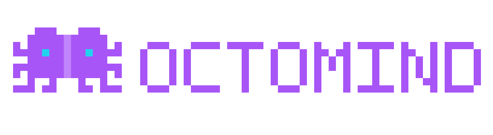

<div align="center">
  <a href="https://octomind.run" target="_blank">
    
  </a>
  <br /><br />
  <strong>Install agents, not frameworks.</strong><br />
  <em>Open-source runtime for specialist AI agents. One command. Any model. Any domain.</em>
  <br /><br />

  [](LICENSE)
  [](https://github.com/muvon/octomind/stargazers)
  [](https://octomind.run)

  <br />

  [Documentation](https://octomind.run/docs/) · [Tap Registry](https://github.com/muvon/octomind-tap) · [Website](https://octomind.run)
</div>

---

## Table of Contents

- [The Problem](#the-problem)
- [Three Pillars](#three-pillars)
- [Pillar 1 — Zero Config, Full Flexibility](#pillar-1--zero-config-full-flexibility)
- [Pillar 2 — Sessions That Stay Sharp at Hour 4](#pillar-2--sessions-that-stay-sharp-at-hour-4)
- [Pillar 3 — Cost as a Control Plane](#pillar-3--cost-as-a-control-plane)
- [Quick Start](#quick-start)
- [How It Works](#how-it-works)
- [Power Users — Roles, Workflows, Layers](#power-users--roles-workflows-layers)
- [Embedders — ACP, WebSocket, Daemon](#embedders--acp-websocket-daemon)
- [Installation](#installation)
- [Configuration](#configuration)
- [Architecture](#architecture)
- [Contributing](#contributing)
- [License](#license)

---

## The Problem

Building a specialist AI agent in 2026 means stitching together three different tools, writing glue code nobody wants to own, and praying it holds. You spend 45 minutes wiring MCP servers, system prompts, tool configs, and credentials — every domain, every machine, every time.

- **Config Wars.** No central registry. Skills here, MCP servers there, agent configs nowhere. The community calls it ["solidarity in frustration."](https://dev.to/satinathnit/the-agent-config-wars-why-your-ai-agent-documentation-is-already-obsolete-4d6i)
- **Generic AI hallucinates in expert domains.** ChatGPT writes wrong drug dosages. Lawyers cite cases that don't exist. Multi-agent specialization is now [the default architecture](https://dev.to/aibughunter/ai-agents-in-april-2026-from-research-to-production-whats-actually-happening-55oc) for serious work.
- **One generic assistant for every task.** Rust debugging, blood-test interpretation, contract review — same prompt, same tools. Drift compounds.
- **Sessions break at hour 4.** Naive truncation drops the decisions you need. Quality collapses. You restart.
- **Bills surprise you.** Cursor users posting $7K daily overages. No per-task budget, no kill switch.

Octomind ships specialist agents ready to run — and a runtime that grows with you.

---

## Three Pillars

| Pillar | What it gives you | Built on |
|---|---|---|
| **Zero config, full flexibility** | `octomind run lawyer:sg` works out of the box. Need a different model, MCP server, or pipeline? Same TOML, no framework code. | Tap registry, runtime self-extension |
| **Sessions stay sharp at hour 4** | SOTA adaptive compaction: cache-aware, structurally preserving. Smaller context = faster responses + lower cost. | `src/mcp/core/plan/compression.rs` |
| **Cost as a control plane** | Per-step model selection across many providers via octolib. Hard spending caps and cache-aware accounting come for free. | `src/config/roles.rs`, spending threshold enforcement |

---

## Pillar 1 — Zero Config, Full Flexibility

Most agent tools force a tradeoff: zero-config (Lindy, no-code) or fully customizable (Mastra, LangGraph). Octomind gives you both. `octomind run lawyer:sg` works out of the box. Need a different model, a custom MCP server, a pipeline of agents — all live in TOML, no framework code.

```bash
octomind run developer            # general dev, language skills auto-activate
octomind run doctor:blood         # blood-test interpretation specialist
octomind run doctor:nutrition     # nutrition specialist
```

### What happens when you run a specialist

```
→ Fetches the agent manifest from the tap registry
→ Installs required binaries automatically (skips if already present)
→ Prompts once for any credentials, saves permanently
→ Spins up the right MCP servers for this domain
→ Loads specialist model config, system prompt, tool permissions
→ Ready in ~5 seconds, not 45 minutes
```

This is **packaged expertise** — not a prompt file, not a skill injection. The full stack, configured by the community, ready to run.

### Specialists grow at runtime

Every agent has built-in power tools that let it acquire new capabilities and spawn sub-agents mid-session, without restart:

| Tool | What it does |
|---|---|
| `tap` | Delegate to any specialist role from the tap registry. Foreground for an inline reply or background for long tasks. |
| `mcp` | Enable or disable MCP servers on the fly. Agent picks the server it needs and registers it mid-conversation. |
| `agent` | Spawn a specialist sub-agent for a sub-task. Sub-agent runs, returns, parent continues. |

```
User: "Cross-reference our Postgres metrics with the deployment log"

Agent:
  → mcp.enable(postgres-mcp)        # auto-detected need, no user prompt
  → agent.spawn(log_reader)         # delegates log parsing
  → results merge mid-session
  → mcp.disable(postgres-mcp)       # cleans up
  → presents the analysis
```

Most agent harnesses pre-load every available tool into context. Octomind starts focused for the domain and grows only when needed. **Smaller context, lower cost, faster responses, no surprise tools.**

### Add your own taps

```bash
octomind tap yourteam/tap                 # clones github.com/yourteam/octomind-tap
octomind tap yourteam/internal ~/path     # local tap for private agents

octomind run finance:analyst              # available immediately
octomind run security:owasp
```

Each tap is a Git repo. Each agent is one TOML file. Pull requests are contributions.

> Want to publish your expertise? A `doctor:medications`, a `lawyer:us`, a `devops:terraform`. One file, and everyone with that problem gets a specialist instantly. [How to write a tap agent →](https://github.com/muvon/octomind-tap)

---

## Pillar 2 — Sessions That Stay Sharp at Hour 4

Every coding agent degrades after a few hours. Context fills. Decisions get truncated. The agent forgets why it started.

Octomind's adaptive compaction engine runs automatically:

- **Cache-aware** — calculates if compaction is worth it *before* paying for it. Never breaks the prompt-cache hit by accident.
- **Pressure-tiered** — compacts more aggressively as context grows.
- **Structurally preserving** — keeps decisions, file references, errors, dependencies; drops noise.
- **Plan-aware and free-form-aware** — works whether you use the `plan` tool or have a free-form chat.
- **Fully automatic** — you never think about it.

The second-order benefit: smaller context means **fewer tokens, faster responses, lower cost** every turn after compaction fires. The three pillars compound.

> Work on a hard problem for 4 hours. The agent still knows what it decided in hour one.

---

## Pillar 3 — Cost as a Control Plane

Pick the right model for each step. A cheap one for routine research, a frontier one for review — per-role, per-step, mid-session swap. Real-time cost tracking and hard spending caps come for free.

```toml
# Per-role model selection — pay Opus only where it's worth it
[[roles]]
name = "researcher"
model = "openrouter:google/gemini-2.5-flash"   # cheap broad context

[[roles]]
name = "reviewer"
model = "anthropic:claude-opus-4-7"            # precision where it counts

# Hard spending limits — enforced, not advisory
max_request_spending_threshold = 0.50    # USD per request
max_session_spending_threshold = 5.00    # USD per session
```

- Per-role and per-layer model selection across many providers via [octolib](https://github.com/muvon/octolib) — different roles can run on different vendors.
- Mid-session model swap with `/model anthropic:claude-haiku-4-5`.
- Real-time cost tracking per request and per session.
- Cache-aware token accounting (`cache_read_tokens`, `cache_write_tokens` separated from input/output).
- Hard spending thresholds with enforcement — agent stops, falls back, or warns before the bill.

> Cursor users get $7,000 surprise bills. Octomind agents trip a budget and stop, fall back, or warn — before the bill, not after.

---

## Quick Start

```bash
# Install (macOS & Linux)
curl -fsSL https://raw.githubusercontent.com/muvon/octomind/master/install.sh | bash

# One API key gets you many providers
export OPENROUTER_API_KEY="your_key"

# Start with a specialist — no setup required
octomind run developer
```

That's it. You're in an interactive session with a specialist that can read your code, run commands, edit files, and grow capabilities as needed.

---

## How It Works

### Built-in MCP tools (every agent has these)

| Tool | Purpose |
|---|---|
| `plan` | Structured multi-step task tracking |
| `mcp` | Enable/disable MCP servers at runtime |
| `agent` | Spawn specialist sub-agents mid-session |
| `schedule` | Inject messages at future times |
| `skill` | Inject reusable instruction packs from taps |
| `tap` | Delegate to any specialist role from a tap registry |

### Filesystem tools (via [octofs](https://github.com/muvon/octofs))

`view`, `text_editor`, `batch_edit`, `shell`, `semantic_search`, `structural_search`, `workdir` — file operations come from the companion octofs MCP server, included by default in tap formulas that need them.

### Brain (via [octobrain](https://github.com/muvon/octobrain))

`memorize`, `remember`, `forget`, `knowledge`, `relate`, `memory_graph` — long-term memory, knowledge indexing, and relationship graphs. The companion octobrain MCP server is included by default in taps that need persistent context across sessions.

### Providers

Octomind supports many providers — OpenRouter, OpenAI, Anthropic, Google, DeepSeek, Amazon Bedrock, Cloudflare, and more — via [octolib](https://github.com/muvon/octolib). New providers added there become available in Octomind automatically. See [Providers & Models](doc/usage/04-providers.md) for the current list and supported models.

Switch providers mid-session with `/model anthropic:claude-sonnet-4-6`. Mix providers across roles — cheap model for research, best model for execution. Cost tracked separately per provider.

---

## Power Users — Roles, Workflows, Layers

For most users, taps are enough. For teams and power users, the configuration system is deep — **all TOML, no code**.

```toml
# Per-role: independent model, temperature, MCP servers, tools, system prompt
[[roles]]
name = "senior-reviewer"
model = "anthropic:claude-opus-4-7"
temperature = 0.2
[roles.mcp]
server_refs = ["filesystem", "github"]
allowed_tools = ["view", "ast_grep", "create_pr"]

# Workflows — multi-step, each step its own model and toolset
[[workflows]]
name = "deep_review"
[[workflows.steps]]
name = "analyze"
layer = "context_researcher"     # gemini-flash, broad context
[[workflows.steps]]
name = "critique"
layer = "senior_reviewer"        # claude-opus, precision

# Sandbox — lock all writes to current directory
sandbox = true
```

- **Roles** — model, temperature, system prompt, MCP servers, tool permissions per role.
- **Layers** — chained AI sub-agents that run after each response.
- **Pipelines** — deterministic script-driven pre-processing.
- **Workflows** — multi-step orchestrated task runners with validation loops.

See [Configuration Reference](doc/reference/03-config-reference.md) for everything.

---

## Embedders — ACP, WebSocket, Daemon

Octomind isn't just a CLI. It runs in every context an agent needs to live in:

| Mode | Use for |
|---|---|
| Interactive CLI | Daily work, any domain |
| `--format jsonl` pipe | CI/CD pipelines, shell scripts, automation |
| `--daemon` + `send` | Background agents, continuous monitoring, long-running tasks |
| WebSocket server | IDE plugins, web dashboards, external integrations |
| ACP protocol | Multi-agent orchestration, being called by other agents |

```bash
# ACP — drop into any multi-agent system as a sub-agent
octomind acp developer:general

# Non-interactive — single message, plain output
octomind run developer "Explain the auth module" --format plain

# Structured JSON output for pipelines
octomind run developer "List TODO items" --schema todos.json --format jsonl
```

One binary. Every workflow.

---

## Installation

### One-line install

```bash
curl -fsSL https://raw.githubusercontent.com/muvon/octomind/master/install.sh | bash
```

Detects OS and architecture, installs to `~/.local/bin/`. macOS and Linux supported. Single Rust binary, no runtime dependencies.

### Cargo

```bash
cargo install octomind
```

Requires Rust 1.95+. See [Building from Source](doc/dev/01-building-from-source.md).

### Build from source

```bash
git clone https://github.com/muvon/octomind.git
cd octomind
cargo build --release
```

### API keys

```bash
# OpenRouter — recommended, access to many providers with one key
export OPENROUTER_API_KEY="your_key"

# Or any specific provider
export OPENAI_API_KEY="your_key"
export ANTHROPIC_API_KEY="your_key"
export DEEPSEEK_API_KEY="your_key"
```

Add to `~/.bashrc` or `~/.zshrc` for persistence.

### Verify

```bash
octomind --version
octomind config       # generate default config
octomind run          # start your first session
```

---

## Configuration

Config lives at `~/.local/share/octomind/config/config.toml`.

```bash
octomind config --show          # view current config
octomind config --validate      # validate config
```

Key areas:

- **Roles** — model, temperature, system prompt, MCP servers, tool permissions
- **Workflows** — multi-step AI processing with validation loops
- **Pipelines** — deterministic script-driven pre-processing
- **MCP Servers** — external tools and capabilities
- **Spending Limits** — per-request and per-session thresholds

Full reference: [Configuration Reference](doc/reference/03-config-reference.md).

### Session commands

| Command | Description |
|---|---|
| `/help` | Show all commands |
| `/info` | Token usage and costs |
| `/model <provider:model>` | Switch model mid-session |
| `/effort <level>` | Set reasoning effort (low/medium/high/xhigh/max) |
| `/role <name>` | Switch role mid-session |
| `/session` | Manage saved sessions (sessions auto-save) |
| `/exit` | Exit session |

Full list: [Session Commands](doc/reference/02-session-commands.md).

---

## Architecture

```
CLI / WebSocket / ACP / Daemon
            |
            v
       ChatSession                  <- src/session/chat/session/
            |
            +-- Roles               <- src/config/roles.rs
            +-- Layers              <- src/session/layers/
            +-- Pipelines           <- src/session/pipelines/
            +-- Workflows           <- src/session/workflows/
            +-- Learning            <- src/learning/
            +-- Adaptive compaction <- src/mcp/core/plan/compression.rs
            |
            +-- MCP servers         <- src/mcp/
                  +-- core/    plan, schedule, tap, capability
                  +-- runtime/ mcp, agent, skill
                  +-- (filesystem via external octofs)
                  +-- (brain via external octobrain)
                  +-- agent/   agent_* tools route tasks to layers
```

**Config is the single source of truth.** All defaults live in `config-templates/default.toml`. The resolved config drives everything: which model, which MCP servers, which layers, which role. No hardcoded values in code.

See [Architecture](doc/dev/02-architecture.md) for internals.

---

## Contributing

The most impactful contribution isn't code — **it's specialist agents.**

Every domain expert who publishes a specialist makes Octomind useful for an entirely new audience. A cardiologist publishing `doctor:medications`. A tax attorney publishing `lawyer:us`. A security researcher publishing `security:owasp`. One TOML file — and everyone with that problem gets a specialist-grade AI instantly.

- [How to write a tap agent](https://github.com/muvon/octomind-tap)
- [Open issues](https://github.com/muvon/octomind/issues)
- [Building from source](doc/dev/01-building-from-source.md)

---

## Documentation

- [Installation & Setup](doc/usage/01-installation.md)
- [Quickstart](doc/usage/02-quickstart.md)
- [Configuration](doc/usage/03-configuration.md)
- [Providers & Models](doc/usage/04-providers.md)
- [Sessions & Compression](doc/usage/05-sessions.md)
- [Roles](doc/usage/06-roles.md)
- [MCP Tools](doc/usage/07-mcp-tools.md)
- [Workflows](doc/usage/09-workflows.md)
- [Pipelines](doc/usage/14-pipelines.md)
- [Learning](doc/usage/13-learning.md)
- [WebSocket & ACP](doc/integration/01-websocket-server.md)
- [CLI Reference](doc/reference/01-cli-reference.md)
- [Config Reference](doc/reference/03-config-reference.md)

Full index: [doc/README.md](doc/README.md).

---

## License

Apache License 2.0 — see [LICENSE](LICENSE).

---

**Octomind** by [Muvon](https://muvon.io) | [Website](https://octomind.run) | [Documentation](https://octomind.run/docs/)
