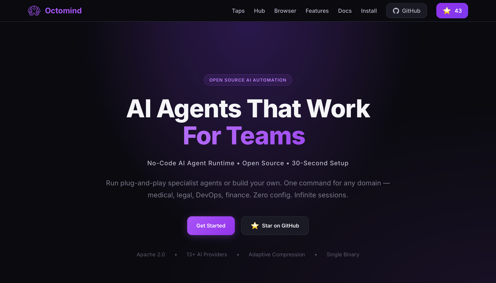

<div align="center">
  <a href="https://octomind.run" target="_blank">
    
  </a>
  <br /><br />
  <strong>Specialist AI agents with cost guardrails and sessions that don't break at hour 4.</strong><br />
  <em>Plug-and-play domain experts. Adaptive compaction. Real spending limits.</em>
  <br /><br />

  [](LICENSE)
  [](https://github.com/muvon/octomind/stargazers)
  [](https://octomind.run)

  <br />

  [Documentation](https://octomind.run/docs/) · [Tap Registry](https://github.com/muvon/octomind-tap) · [Website](https://octomind.run)
</div>

---

## Table of Contents

- [The Problem](#the-problem)
- [Three Pillars](#three-pillars)
- [Pillar 1 — Cost as a Control Plane](#pillar-1--cost-as-a-control-plane)
- [Pillar 2 — Zero-Config Specialist Agents](#pillar-2--zero-config-specialist-agents)
- [Pillar 3 — Sessions That Don't Break at Hour 4](#pillar-3--sessions-that-dont-break-at-hour-4)
- [Quick Start](#quick-start)
- [How It Works](#how-it-works)
- [Power Users — Roles, Workflows, Layers](#power-users--roles-workflows-layers)
- [Embedders — ACP, WebSocket, Daemon](#embedders--acp-websocket-daemon)
- [Installation](#installation)
- [Configuration](#configuration)
- [Architecture](#architecture)
- [Contributing](#contributing)
- [License](#license)

---

## The Problem

You want an AI that knows your domain, costs what you expected, and remembers what it decided an hour ago. In 2026 you get:

- **45 minutes of setup per domain** — MCP servers, system prompts, tool configs, credentials, all wired by hand, every time.
- **Surprise bills.** Cursor users posting $7K daily overages. Claude Code rate-limiting mid-task. No per-task budget, no simulator, no kill switch.
- **Context rot at hour 2-4.** Naive truncation drops the decisions you need. Quality collapses. You restart.
- **One generic assistant** for every task — Rust debugging, blood-test interpretation, contract review — same prompt, same tools.

Every coding agent in 2026 swaps models and calls it a feature. Octomind solves the three things they don't.

---

## Three Pillars

| Pillar | What it gives you | Built on |
|---|---|---|
| **Cost as a control plane** | Per-request and per-session spending limits, real-time cost tracking, cache-aware accounting. | `src/config/roles.rs`, spending threshold enforcement |
| **Zero-config specialist agents** | `octomind run aws-debug` → prompts + MCP servers + tools, all pre-wired. Agents auto-enable new MCP servers mid-session and spawn sub-agents. | Tap registry, `mcp` and `agent` built-in tools, runtime self-extension |
| **Sessions that don't break at hour 4** | SOTA adaptive compaction: cache-aware, structurally preserving. Smaller context = faster responses + lower cost. | `src/mcp/core/plan/compression.rs` |

---

## Pillar 1 — Cost as a Control Plane

Cost is treated as infrastructure, not an afterthought.

```toml
# Hard spending limits — enforced, not advisory
max_request_spending_threshold = 0.50    # USD per request
max_session_spending_threshold = 5.00    # USD per session

# Per-role model selection — pay Opus only where it's worth it
[[roles]]
name = "researcher"
model = "google:gemini-2.5-flash"   # cheap broad context

[[roles]]
name = "reviewer"
model = "anthropic:claude-opus-4"   # precision where it counts
```

What's already shipped:
- Real-time cost tracking per request and per session.
- Cache-aware token accounting (`cache_read_tokens`, `cache_write_tokens` separated from input/output).
- Hard spending thresholds with enforcement.
- Per-role and per-layer model selection — different roles can run on different providers.

What's in flight:
- Cost simulator (`octomind cost simulate <agent> --runs N`).
- Provider arbitrage — dynamic routing on cost-per-quality-point.
- Per-provider budgets and alerts.

> Cursor users get $7,000 surprise bills. Octomind agents trip a budget and stop, fall back, or warn — before the bill, not after.

---

## Pillar 2 — Zero-Config Specialist Agents

Most agent tools force you to assemble a system prompt, choose MCP servers, set up role config, and manage credentials — for every domain, on every machine, every time. Octomind ships specialists ready to run.

```bash
octomind run developer            # general dev, language skills auto-activate
octomind run doctor:blood         # blood-test interpretation specialist
octomind run doctor:nutrition     # nutrition specialist
```

### What happens when you run a specialist

```
→ Fetches the agent manifest from the tap registry
→ Installs required binaries automatically (skips if already present)
→ Prompts once for any credentials, saves permanently
→ Spins up the right MCP servers for this domain
→ Loads specialist model config, system prompt, tool permissions
→ Ready in ~5 seconds, not 45 minutes
```

This is **packaged expertise** — not a prompt file, not a skill injection. The full stack, configured by the community, ready to run.

### Specialists grow at runtime

Every agent has two built-in power tools that let it acquire new capabilities and spawn sub-agents mid-session, without restart:

| Tool | What it does |
|---|---|
| `mcp` | Enable or disable MCP servers on the fly. Agent picks the server it needs and registers it mid-conversation. |
| `agent` | Spawn a specialist sub-agent for a sub-task. Sub-agent runs, returns, parent continues. |

```
User: "Cross-reference our Postgres metrics with the deployment log"

Agent:
  → mcp.enable(postgres-mcp)        # auto-detected need, no user prompt
  → agent.spawn(log_reader)         # delegates log parsing
  → results merge mid-session
  → mcp.disable(postgres-mcp)       # cleans up
  → presents the analysis
```

OpenClaw pre-loads 5,700 skills into every agent. Octomind starts focused for the domain and grows only when needed. **Smaller context, lower cost, faster responses, no surprise tools.**

### Add your own taps

```bash
octomind tap yourteam/tap                 # clones github.com/yourteam/octomind-tap
octomind tap yourteam/internal ~/path     # local tap for private agents

octomind run finance:analyst              # available immediately
octomind run security:owasp
```

Each tap is a Git repo. Each agent is one TOML file. Pull requests are contributions.

> Want to publish your expertise? A `doctor:medications`, a `lawyer:us`, a `devops:terraform`. One file, and everyone with that problem gets a specialist instantly. [How to write a tap agent →](https://github.com/muvon/octomind-tap)

---

## Pillar 3 — Sessions That Don't Break at Hour 4

Every coding agent degrades after a few hours. Context fills. Decisions get truncated. The agent forgets why it started.

Octomind's adaptive compaction engine runs automatically:

- **Cache-aware** — calculates if compaction is worth it *before* paying for it. Never breaks the prompt-cache hit by accident.
- **Pressure-tiered** — compacts more aggressively as context grows.
- **Structurally preserving** — keeps decisions, file references, errors, dependencies; drops noise.
- **Plan-aware and free-form-aware** — works whether you use the `plan` tool or have a free-form chat.
- **Fully automatic** — you never think about it.

The second-order benefit: smaller context means **fewer tokens, faster responses, lower cost** every turn after compaction fires. The three pillars compound.

> Work on a hard problem for 4 hours. The agent still knows what it decided in hour one.

---

## Quick Start

```bash
# Install (macOS & Linux)
curl -fsSL https://raw.githubusercontent.com/muvon/octomind/master/install.sh | bash

# One API key gets you many providers
export OPENROUTER_API_KEY="your_key"

# Start with a specialist — no setup required
octomind run developer
```

That's it. You're in an interactive session with a specialist that can read your code, run commands, edit files, and grow capabilities as needed.

---

## How It Works

### Built-in MCP tools (every agent has these)

| Tool | Purpose |
|---|---|
| `plan` | Structured multi-step task tracking |
| `mcp` | Enable/disable MCP servers at runtime |
| `agent` | Spawn specialist sub-agents mid-session |
| `schedule` | Inject messages at future times |
| `skill` | Inject reusable instruction packs from taps |

### Filesystem tools (via [octofs](https://github.com/muvon/octofs))

`view`, `text_editor`, `batch_edit`, `shell`, `semantic_search`, `structural_search`, `workdir` — file operations come from the companion octofs MCP server, included by default in tap formulas that need them.

### Memory tools (via [octomem](https://github.com/muvon/octomem))

`remember`, `memorize`, `knowledge`, `graphrag` — long-term memory and knowledge indexing, included by default in taps that need persistent context.

### Providers

| Provider | Notes |
|---|---|
| **OpenRouter** | Many frontier models, one API key |
| **OpenAI** | GPT-4o, o3, Codex |
| **Anthropic** | Claude Opus, Sonnet, Haiku |
| **Google** | Gemini 2.5 Pro/Flash |
| **Amazon Bedrock** | Claude + Titan on AWS |
| **Cloudflare** | Workers AI |
| **DeepSeek** | V3, R1 |

Switch providers mid-session with `/model deepseek:v3`. Mix providers across roles — cheap model for research, best model for execution. Cost tracked separately per provider.

---

## Power Users — Roles, Workflows, Layers

For most users, taps are enough. For teams and power users, the configuration system is deep — **all TOML, no code**.

```toml
# Per-role: independent model, temperature, MCP servers, tools, system prompt
[[roles]]
name = "senior-reviewer"
model = "anthropic:claude-opus-4"
temperature = 0.2
[roles.mcp]
server_refs = ["filesystem", "github"]
allowed_tools = ["view", "ast_grep", "create_pr"]

# Workflows — multi-step, each step its own model and toolset
[[workflows]]
name = "deep_review"
[[workflows.steps]]
name = "analyze"
layer = "context_researcher"     # gemini-flash, broad context
[[workflows.steps]]
name = "critique"
layer = "senior_reviewer"        # claude-opus, precision

# Sandbox — lock all writes to current directory
sandbox = true
```

- **Roles** — model, temperature, system prompt, MCP servers, tool permissions per role.
- **Layers** — chained AI sub-agents that run after each response.
- **Pipelines** — deterministic script-driven pre-processing.
- **Workflows** — multi-step orchestrated task runners with validation loops.

See [Configuration Reference](doc/reference/03-config-reference.md) for everything.

---

## Embedders — ACP, WebSocket, Daemon

Octomind isn't just a CLI. It runs in every context an agent needs to live in:

| Mode | Use for |
|---|---|
| Interactive CLI | Daily work, any domain |
| `--format jsonl` pipe | CI/CD pipelines, shell scripts, automation |
| `--daemon` + `send` | Background agents, continuous monitoring, long-running tasks |
| WebSocket server | IDE plugins, web dashboards, external integrations |
| ACP protocol | Multi-agent orchestration, being called by other agents |

```bash
# ACP — drop into any multi-agent system as a sub-agent
octomind acp developer:general

# Non-interactive — single message, plain output
octomind run developer "Explain the auth module" --format plain

# Structured JSON output for pipelines
octomind run developer "List TODO items" --schema todos.json --format jsonl
```

One binary. Every workflow.

---

## Installation

### One-line install

```bash
curl -fsSL https://raw.githubusercontent.com/muvon/octomind/master/install.sh | bash
```

Detects OS and architecture, installs to `~/.local/bin/`. macOS and Linux supported. Single Rust binary, no runtime dependencies.

### Cargo

```bash
cargo install octomind
```

Requires Rust 1.82+. See [Building from Source](doc/dev/01-building-from-source.md).

### Build from source

```bash
git clone https://github.com/muvon/octomind.git
cd octomind
cargo build --release
```

### API keys

```bash
# OpenRouter — recommended, access to many providers with one key
export OPENROUTER_API_KEY="your_key"

# Or any specific provider
export OPENAI_API_KEY="your_key"
export ANTHROPIC_API_KEY="your_key"
export DEEPSEEK_API_KEY="your_key"
```

Add to `~/.bashrc` or `~/.zshrc` for persistence.

### Verify

```bash
octomind --version
octomind config       # generate default config
octomind run          # start your first session
```

---

## Configuration

Config lives at `~/.local/share/octomind/config/config.toml`.

```bash
octomind config --show          # view current config
octomind config --validate      # validate config
```

Key areas:

- **Roles** — model, temperature, system prompt, MCP servers, tool permissions
- **Workflows** — multi-step AI processing with validation loops
- **Pipelines** — deterministic script-driven pre-processing
- **MCP Servers** — external tools and capabilities
- **Spending Limits** — per-request and per-session thresholds

Full reference: [Configuration Reference](doc/reference/03-config-reference.md).

### Session commands

| Command | Description |
|---|---|
| `/help` | Show all commands |
| `/info` | Token usage and costs |
| `/model <provider:model>` | Switch model mid-session |
| `/role <name>` | Switch role mid-session |
| `/save` | Save current session |
| `/exit` | Exit session |

Full list: [Session Commands](doc/reference/02-session-commands.md).

---

## Architecture

```
CLI / WebSocket / ACP / Daemon
            |
            v
       ChatSession                  <- src/session/chat/session/
            |
            +-- Roles               <- src/config/roles.rs
            +-- Layers              <- src/session/layers/
            +-- Pipelines           <- src/session/pipelines/
            +-- Workflows           <- src/session/workflows/
            +-- Learning            <- src/learning/
            +-- Adaptive compaction <- src/mcp/core/plan/compression.rs
            |
            +-- MCP servers         <- src/mcp/
                  +-- core/  plan, mcp, agent, schedule, skill
                  +-- (filesystem via external octofs)
                  +-- (memory via external octomem)
                  +-- agent/ agent_* tools route tasks to layers
```

**Config is the single source of truth.** All defaults live in `config-templates/default.toml`. The resolved config drives everything: which model, which MCP servers, which layers, which role. No hardcoded values in code.

See [Architecture](doc/dev/02-architecture.md) for internals.

---

## Contributing

The most impactful contribution isn't code — **it's specialist agents.**

Every domain expert who publishes a specialist makes Octomind useful for an entirely new audience. A cardiologist publishing `doctor:medications`. A tax attorney publishing `lawyer:us`. A security researcher publishing `security:owasp`. One TOML file — and everyone with that problem gets a specialist-grade AI instantly.

- [How to write a tap agent](https://github.com/muvon/octomind-tap)
- [Open issues](https://github.com/muvon/octomind/issues)
- [Building from source](doc/dev/01-building-from-source.md)

---

## Documentation

- [Installation & Setup](doc/usage/01-installation.md)
- [Quickstart](doc/usage/02-quickstart.md)
- [Configuration](doc/usage/03-configuration.md)
- [Providers & Models](doc/usage/04-providers.md)
- [Sessions & Compression](doc/usage/05-sessions.md)
- [Roles](doc/usage/06-roles.md)
- [MCP Tools](doc/usage/07-mcp-tools.md)
- [Workflows](doc/usage/09-workflows.md)
- [Pipelines](doc/usage/14-pipelines.md)
- [Learning](doc/usage/13-learning.md)
- [WebSocket & ACP](doc/integration/01-websocket-server.md)
- [CLI Reference](doc/reference/01-cli-reference.md)
- [Config Reference](doc/reference/03-config-reference.md)

Full index: [doc/README.md](doc/README.md).

---

## License

Apache License 2.0 — see [LICENSE](LICENSE).

---

**Octomind** by [Muvon](https://muvon.io) | [Website](https://octomind.run) | [Documentation](https://octomind.run/docs/)
