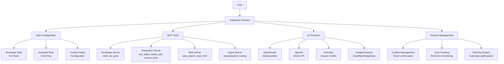

# Octomind Overview

## What is Octomind?

Octomind is a session-first AI development assistant that transforms how you interact with codebases through natural language conversations. Built on the Model Context Protocol (MCP), it provides seamless integration with development tools, multi-provider AI support, and intelligent cost optimization.

**Key Principles:**
- **Session-First**: Everything happens in interactive AI conversations
- **Tool Integration**: Built-in MCP tools for development, filesystem, web, and agent operations
- **Multi-Provider**: Unified interface across 7 AI providers
- **Cost Optimization**: Smart caching and real-time usage tracking
- **Role-Based**: Developer (full tools) and Assistant (chat-only) configurations

## Architecture Overview

Octomind implements a clean, session-first architecture:



## Core Components

### 1. Session-First Design

**Interactive AI Conversations**: All functionality is accessed through natural language sessions with persistent context and intelligent management.

**Key Features:**
- **Persistent Context**: Sessions maintain conversation history with smart truncation
- **Smart Continuation**: Automatic context preservation when token limits are reached
- **Cost Tracking**: Real-time monitoring of usage and costs across sessions
- **Session Management**: Save, resume, and organize conversations by name

### 2. MCP Tool System

**Built-in MCP Servers** provide comprehensive development capabilities:

**Developer Server** (`src/mcp/dev/`):
- `shell(command="...", background=false)` - Execute shell commands with output capture, foreground/background execution
- `ast_grep(pattern="...", language="...", rewrite="...", ...)` - Search and refactor code using AST patterns
- `plan(command="start|step|next|list|done|reset", ...)` - Structured task management with progress tracking

**Filesystem Server** (`src/mcp/fs/`):
- `text_editor(command="view|create|str_replace|insert|line_replace|undo_edit|view_many", path="...", ...)` - File operations
- `list_files(directory="...", pattern="...", content="...", ...)` - Directory listing with filtering and content search
- `batch_edit(path="...", operations=[...])` - Multiple file operations atomically
- `extract_lines(from_path="...", from_range=[start, end], append_path="...", append_line=N)` - Extract and move code blocks
- `semantic_search(query="...", ...)` - Semantic code search using descriptive queries about functionality
- `view_signatures(files=[...])` - Extract function signatures and class definitions from files
- `graphrag(operation="search|get-node|get-relationships|find-path|overview", ...)` - Advanced relationship-aware code analysis
- `memorize(title="...", content="...", ...)` - Store important information for future reference
- `remember(query="...", limit=5, ...)` - Search and retrieve stored memories using semantic search
- `forget(confirm=true, query="...", ...)` - Permanently remove specific memories

**Web Server** (`src/mcp/web/`):
- `web_search(query="...", count=20, ...)` - Search the web using Brave Search API
- `image_search(query="...", count=50, ...)` - Search for images with metadata and thumbnails
- `video_search(query="...", count=20, ...)` - Search for videos with duration and creator info
- `news_search(query="...", count=20, ...)` - Search for news articles with publication dates
- `read_html(sources=[...])` - Convert HTML content to Markdown format

**Agent Server** (`src/mcp/agent/`):
- `agent_*()` tools - Route tasks to configured AI layers for specialized processing
- `call_llm(prompt="...", model="...", system="...", temperature=0.7)` - Direct LLM call with runtime parameters

**External Server Support**:
- HTTP MCP servers with OAuth 2.1 + PKCE authentication
- Command-based (stdin) MCP servers
- Health monitoring and automatic recovery
- Server registry for centralized configuration


### 3. Multi-Provider AI Support

**Unified Interface** across 7 AI providers with consistent `provider:model` format:

| Provider | Format | Key Features |
|----------|--------|--------------|
| **OpenRouter** | `openrouter:provider/model` | Multi-provider access, caching, vision |
| **OpenAI** | `openai:model-name` | Direct API, GPT-4o vision, cost calculation |
| **Anthropic** | `anthropic:model-name` | Claude models, caching, vision support |
| **Google** | `google:model-name` | Vertex AI, Gemini 1.5+ vision |
| **Amazon** | `amazon:model-name` | Bedrock models, AWS integration |
| **Cloudflare** | `cloudflare:model-name` | Edge AI, fast inference |
| **DeepSeek** | `deepseek:model-name` | Cost-effective models |

### 4. Role-Based Configuration

**Developer Role** (`config-templates/default.toml` lines 156-337):
- Full access to all MCP tools
- Optimized system prompts for development tasks
- Layer processing enabled for complex workflows
- Server references: developer, filesystem, web, agent

**Assistant Role** (lines 340-355):
- Chat-only mode with limited tool access
- General assistance system prompts
- Minimal tool permissions for safety

**Custom Roles**: Define specific tool permissions and configurations

### 5. Smart Cost Optimization

**Automatic Caching**:
- Cache markers for expensive operations
- Provider-specific cache support (Anthropic Claude, etc.)
- Configurable cache thresholds and timeouts

**Adaptive Context Compression**:
- Token-based compression triggers at configurable thresholds (50k, 100k, 150k tokens)
- Pressure-level system with graduated compression ratios (2x, 4x, 8x)
- Hierarchical compression: task → phase → project levels
- Preserves architectural information and file references during compression
- Decision model (Haiku) for cost-efficient compression decisions

**Context Awareness**:
- Real-time context percentage display in prompt (e.g., `[0.02|45.3%]`)
- Shows estimated cost and context usage percentage
- Unified token calculation including messages, system prompt, and tool definitions

**Real-Time Tracking**:
- Per-session cost monitoring
- Per-request spending thresholds
- Detailed usage reporting with `/report` command

**Context Management**:
- Smart truncation when limits approached
- AI-driven context preservation during continuation
- Efficient token usage optimization
## Key Features

### Multimodal Vision Support

**Image Analysis** with `/image <path>` command:
- Support for PNG, JPEG, GIF, WebP, BMP, and other formats
- Vision capabilities across all supported providers
- Intelligent file completion and path resolution
- Use cases: UI analysis, diagram interpretation, code screenshots

### Smart Session Continuation

**Adaptive Context Management** (`src/session/chat/continuation/`):
- AI-driven context preservation when token limits reached
- File context parsing with `filename:startline:endline` format
- Automatic conversation compression at configurable thresholds
- Hierarchical compression: task → phase → project levels
- Visual feedback showing continuation status
- Zero configuration required

### Layered Processing System

**AI Pipeline Architecture** (`src/session/layers/`):
- Task refinement and research layers
- Custom command execution with `/run <command>`
- Agent system for specialized AI routing
- Configurable input/output modes

### Brain-Inspired Workflow System

**Multi-Step Planning and Execution** (`src/session/workflows/`):
- **Planner vs Executor**: Workflows act as planners (prefrontal cortex), main model executes (motor cortex)
- **Control Flow Primitives**: Once, Loop, Foreach, Conditional, Parallel step types
- **Validation and Feedback**: Built-in validation loops and iterative refinement
- **Non-intrusive**: Workflows don't affect session history
- **Execution**: Use `/workflow <name>` command to execute configured workflows

**Workflow Architecture**:
```
User Input
    ↓
┌─────────────────────────────────────┐
│  WORKFLOW (Planning)                │
│  • Decomposes tasks                 │
│  • Validates approaches             │
│  • Predicts impacts                 │
│  • Evaluates quality                │
│  • Generates enhanced plan          │
└──────────────┬──────────────────────┘
               ↓ Enhanced Plan
┌─────────────────────────────────────┐
│  MAIN MODEL (Execution)             │
│  • Receives refined plan            │
│  • Uses MCP tools                   │
│  • Implements changes               │
└─────────────────────────────────────┘
               ↓
            Result
```

For comprehensive workflow documentation, see [doc/10-workflows.md](./10-workflows.md).

### Advanced Development Tools

**AST-Based Code Operations**:
- `ast_grep()` for structural code search and refactoring
- Pattern-based transformations using AST understanding
- Language-aware code analysis

**Batch File Operations**:
- `batch_edit()` for atomic multi-line changes
- Original line number preservation
- Conflict detection and rollback

## Usage Patterns

### Development Workflow

```bash
# Start development session
octomind session

# Natural language interactions
> "How does authentication work in this project?"
> "Add error handling to the login function"
> "Refactor the database connection code"

# Use built-in tools
> shell(command="cargo test")
> text_editor(command="view", path="src/main.rs", view_range=[1, 50])
> ast_grep(pattern="fn $NAME($ARGS)", language="rust")
```

### Session Commands

Essential commands for session management:
- `/help` - Show available commands
- `/info` - Display token usage and costs
- `/image <path>` - Attach images for AI analysis
- `/mcp info` - Check MCP server status
- `/model <model>` - Switch AI models
- `/cache` - Add cache checkpoint
- `/done` - Finalize task with memorization

### Cost Management

**Real-Time Monitoring**:
- `/info` - Current session costs and token usage
- `/report` - Detailed cost breakdown by request
- Automatic cache markers for optimization
- Spending thresholds and warnings

## Configuration System

### Template-Based Configuration

**Default Template** (`config-templates/default.toml`):
- All defaults defined in template file
- Environment variable overrides with `OCTOMIND_*` prefix
- Role-specific configurations
- MCP server definitions

**Key Configuration Sections**:
- System-wide settings (model, max_tokens, log_level)
- Role configurations (developer, assistant, custom)
- MCP server definitions (built-in and external)
- Layer configurations for AI processing pipeline

### Environment Overrides

```bash
# System settings
export OCTOMIND_MODEL="openrouter:anthropic/claude-sonnet-4"
export OCTOMIND_LOG_LEVEL="debug"

# Role-specific settings
export OCTOMIND_ROLES__DEVELOPER__TEMPERATURE="0.1"
export OCTOMIND_ROLES__DEVELOPER__MAX_TOKENS="16384"
```

## Getting Started

### Quick Start

1. **Install**: `curl -fsSL https://raw.githubusercontent.com/muvon/octomind/master/install.sh | bash`
2. **Set API Key**: `export OPENROUTER_API_KEY="your_key"`
3. **Start Session**: `octomind session`
4. **Try Commands**: `/help`, `/info`, `/mcp info`

### Next Steps

- **[Installation Guide](./01-installation.md)** - Detailed setup and prerequisites
- **[Configuration Guide](./03-configuration.md)** - Customize settings and roles
- **[Provider Setup](./04-providers.md)** - Configure AI models and keys
- **[Sessions Guide](./05-sessions.md)** - Master interactive sessions
- **[Advanced Features](./06-advanced.md)** - MCP tools and extensibility
- **[Command Layers](./07-command-layers.md)** - AI processing pipeline
- **[MCP Development](./08-mcp-server-development.md)** - Tool development

---

**Octomind v0.17.0** - Session-first AI development assistant with built-in MCP tools and multi-provider support.
