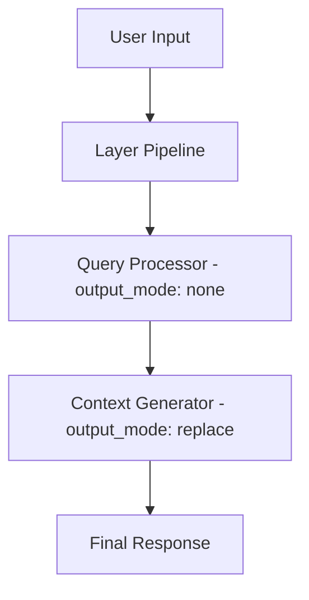

# Session Modes and Interactive Usage

## Overview
- Sessions are always interactive (no batch mode)
- Session continuation: automatic when token limits are reached (modular, user-visible)
- **Cache/cost tracking**: All sessions track token usage and cost in real time
- **Role selection**: Use `--role` or config to pick developer/assistant/custom
- **/run**: run command layers (no history impact); **agent_<name>**: call agent tools as needed

## Session Roles Comparison

| Feature | Developer Role | Assistant Role | Custom Roles |
|---------|----------------|----------------|---------------|
| **Purpose** | Full development assistance | Simple conversation | Specialized use cases |
| **Indexing** | Full codebase indexing | No indexing (faster startup) | Configurable |
| **Tools** | All development tools enabled | Tools disabled by default | Configurable |
| **Layers** | Supports layered architecture | Direct model interaction | Configurable |
| **Context** | Full project context | Minimal context | Configurable |
| **Resource Usage** | Higher (more features) | Lower (lightweight) | Depends on configuration |
| **Inheritance** | Inherits from global config | Base for custom roles | Inherits from assistant |

## Developer Role

Developer role is the default and provides comprehensive development assistance.

### Starting Developer Role

```bash
# Default role (developer)
octomind session

# Explicitly specify developer role
octomind session --role=developer

# Developer role with specific model
octomind session --role=developer --model="openrouter:anthropic/claude-sonnet-4"

# Named developer session
octomind session --role=developer -n development_session
```

### Developer Role Features

#### Full Tool Access
- **Shell commands**: Execute terminal commands
- **File operations**: Read, write, edit files
- **Code search**: Semantic code search
- **Project analysis**: Understanding codebase structure
- **GraphRAG**: Code relationship analysis

#### Project Context Collection
- README.md content
- Git status and branch information
- File tree structure
- Project metadata

#### Layered Architecture
Three-layer processing for complex tasks:
1. **Query Processor**: Analyzes user requests
2. **Context Generator**: Gathers relevant information
3. **Developer**: Executes development tasks

### Developer Role Configuration

```toml
[developer]
enable_layers = true
layer_refs = []
system = "You are an Octomind AI developer assistant with full access to development tools."

# MCP configuration using current server structure
[developer.mcp]
server_refs = ["developer", "filesystem", "octocode"]
allowed_tools = []  # Empty means all tools from referenced servers

# Server definitions in main MCP section
[mcp]
allowed_tools = []

[[mcp.servers]]
name = "developer"
type = "builtin"
timeout_seconds = 30
args = []
tools = []

[[mcp.servers]]
name = "filesystem"
type = "builtin"
timeout_seconds = 30
args = []
tools = []
```

## Assistant Role

Assistant role is optimized for lightweight conversations without the overhead of full development tools.

### Starting Assistant Role

```bash
# Assistant role
octomind session --role=assistant

# Assistant role with specific model
octomind session --role=assistant --model="openai:gpt-4o-mini"

# Named assistant session
octomind session --role=assistant -n quick_chat
```

### Assistant Role Features

#### Lightweight Operation
- No codebase indexing
- Faster startup time
- Lower resource usage
- Simpler system prompts

#### Optional Tool Access
```toml
[assistant.mcp]
enabled = true  # Can enable tools if needed
server_refs = ["filesystem"]  # Specific servers only
allowed_tools = ["text_editor", "list_files"]  # Limited tools
```

### Assistant Role Configuration

```toml
[assistant]
model = "openrouter:anthropic/claude-3.5-haiku"
enable_layers = false
system = "You are a helpful assistant."

[assistant.mcp]
enabled = false  # Tools disabled by default
```

## Custom Roles

Custom roles inherit from the assistant role as a base, then apply their own overrides. This provides a flexible system for creating specialized configurations.

### Creating Custom Roles

```bash
# Use a custom role
octomind session --role=code-reviewer
octomind session --role=security-analyst
octomind session --role=documentation-writer
```

### Custom Role Configuration

```toml
# Code reviewer role
[code-reviewer]
model = "openrouter:anthropic/claude-3.5-sonnet"
enable_layers = true
system = "You are a code review expert focused on security and best practices."

[code-reviewer.mcp]
enabled = true
server_refs = ["developer", "filesystem"]
allowed_tools = ["text_editor", "list_files"]

# Security analyst role
[security-analyst]
model = "openrouter:anthropic/claude-3.5-sonnet"
enable_layers = true
system = "You are a security expert focused on finding vulnerabilities and security issues."

[security-analyst.mcp]
enabled = true
server_refs = ["developer"]
allowed_tools = ["shell"]  # Limited to analysis tools

# Documentation writer role
[documentation-writer]
model = "openrouter:openai/gpt-4o"
enable_layers = false
system = "You are a technical writer focused on creating clear, comprehensive documentation."

[documentation-writer.mcp]
enabled = true
server_refs = ["filesystem"]
allowed_tools = ["text_editor", "list_files"]  # Only file operations
```

### Role Inheritance

Custom roles follow this inheritance pattern:
1. **Start with assistant role** as the base configuration
2. **Apply custom overrides** from the role-specific configuration
3. **Merge MCP settings** with server registry references

```toml
# Assistant base (inherited by all custom roles)
[assistant]
model = "openrouter:anthropic/claude-3.5-haiku"
enable_layers = false
system = "You are a helpful assistant."

[assistant.mcp]
enabled = false

# Custom role inherits from assistant, then applies overrides
[my-custom-role]
model = "openrouter:openai/gpt-4o"  # Override model
enable_layers = true                # Override layers
system = "Custom system prompt"     # Override system prompt

[my-custom-role.mcp]
enabled = true                      # Override MCP enabled
server_refs = ["filesystem"]        # Add specific servers
```

## System Variables and Placeholders

Octomind supports dynamic system variables that can be used in prompts and system messages. These variables provide real-time information about your development environment.

### Available Variables

**Individual Variables:**
- **`%{DATE}`** - Current date and time with timezone
- **`%{SHELL}`** - Current shell name and version
- **`%{OS}`** - Operating system information with architecture and platform details
- **`%{BINARIES}`** - List of available development tools and their versions (one per line)
- **`%{CWD}`** - Current working directory
- **`%{ROLE}`** - Current session role (developer, assistant, etc.)
- **`%{GIT_STATUS}`** - Git repository status
- **`%{GIT_TREE}`** - Git file tree
- **`%{README}`** - Project README content

**Comprehensive Variables:**
- **`%{SYSTEM}`** - Complete system information (date, shell, OS, binaries, CWD)
- **`%{CONTEXT}`** - Project context information (README, git status, git tree)

### Viewing Variables

Use the `vars` command to inspect all available variables:

```bash
# List all variables with descriptions
octomind vars

# Show actual values (expanded view)
octomind vars --expand
octomind vars -e
```

### Development Tool Detection

The `%{BINARIES}` variable automatically detects and reports versions of common development tools:

- **Build tools**: `rustc`, `gcc`, `clang`, `make`
- **Languages**: `node`, `npm`, `python`, `python3`, `go`, `java`, `php`
- **Utilities**: `awk`, `sed`, `rg`, `git`, `docker`, `curl`, `wget`, `tar`, `zip`, `unzip`

Tools are detected asynchronously for optimal performance, showing either their version or "missing" if not available.

## Markdown Themes

Octomind includes a beautiful markdown rendering system with multiple themes to enhance your experience.

### Available Themes

| Theme | Description | Best For |
|-------|-------------|----------|
| `default` | Improved default theme with gold headers and enhanced contrast | Most terminal setups |
| `dark` | Optimized for dark terminals with bright, vibrant colors | Dark terminal backgrounds |
| `light` | Perfect for light terminal backgrounds with darker colors | Light terminal backgrounds |
| `ocean` | Beautiful blue-green palette inspired by ocean themes | Users who prefer calm, aquatic colors |
| `solarized` | Based on the popular Solarized color scheme | Fans of the classic Solarized palette |
| `monokai` | Inspired by the popular Monokai syntax highlighting theme | Users familiar with Monokai from code editors |

### Configuring Themes

```bash
# Set a theme
octomind config --markdown-theme ocean

# Enable markdown rendering (if not already enabled)
octomind config --markdown-enable true

# View current theme
octomind config --show

# See all available themes (error message shows valid options)
octomind config --markdown-theme invalid
```

All themes include headers, code blocks, inline code, lists, emphasis, quotes, and links with appropriate styling.

## Custom Instructions

Octomind supports automatic loading of project-specific instructions that are included in every new session. This feature allows you to provide context, guidelines, or project-specific information that helps the AI understand your project better.

### How It Works

When starting a new session, Octomind automatically checks for a custom instructions file in your current working directory. If found, the content is loaded and added as a user message after the welcome message.

### Configuration

```toml
# In your config file
custom_instructions_file_name = "INSTRUCTIONS.md"

# Or via environment variable
export OCTOMIND_CUSTOM_INSTRUCTIONS_FILE_NAME="PROJECT_GUIDE.md"

# Disable by setting to empty string
custom_instructions_file_name = ""
```

### Template Variable Support

Custom instructions files support all the same template variables as system prompts:

```markdown
# Project: My Awesome Project
Working Directory: %{CWD}
Current Role: %{ROLE}
Date: %{DATE}

## Project Guidelines
- Follow the existing code patterns in this codebase
- Use semantic versioning for releases
- All API changes require documentation updates

## Architecture Notes
%{SYSTEM}

## Current Project Status
%{GIT_STATUS}
```

### Best Practices

1. **Keep it concise**: Focus on essential project information
2. **Use template variables**: Make instructions dynamic with `%{ROLE}`, `%{CWD}`, etc.
3. **Project-specific**: Include information unique to your project
4. **Version control**: Include the instructions file in your repository
5. **Role-aware**: Use `%{ROLE}` to provide different guidance for different roles

### Example INSTRUCTIONS.md

```markdown
# %{PROJECT_NAME} Development Guide

**Role**: %{ROLE} | **Directory**: %{CWD} | **Date**: %{DATE}

## Project Overview
This is a Rust-based AI development assistant using the MCP protocol.

## Development Principles
- Configuration is template-based with no hardcoded defaults
- All API keys must be set via environment variables
- Use batch_edit for multiple file changes
- Check memories first before investigating new areas

## Key Files
- `config-templates/default.toml` - Master configuration template
- `src/config/` - Configuration handling modules
- `src/session/` - Core session management
- `src/mcp/` - MCP protocol implementation

## Current Architecture
%{CONTEXT}
```

### Caching and Performance

Custom instructions are automatically cached like system prompts, making them token-efficient for repeated use. The content is processed once per session and reused throughout the conversation.

## Session Management

### Creating and Managing Sessions

```bash
# Create new named session
octomind session -n project_review

# Resume existing session
octomind session -r project_review

# List all sessions
octomind session --list

# Session with custom model
octomind session --model="anthropic:claude-sonnet-4" -n analysis
```

### Session Commands

## Session Commands

Octomind provides comprehensive session management through built-in commands:

### Core Session Commands
- `/help` - Show all available commands
- `/info` - Display token usage and costs
- `/report` - Generate detailed usage report with cost breakdown
- `/context [filter]` - Display session context (all, assistant, user, tool, large)
- `/model [model]` - View or change current AI model
- `/role [role]` - View or switch session role

### File and Image Operations
- `/image <path>` - Attach image to next message (PNG, JPEG, GIF, WebP, BMP)
- `/save` - Save current session
- `/clear` - Clear terminal screen
- `/copy` - Copy last assistant response to clipboard

### Context and Memory Management
- `/cache` - Mark cache checkpoint for cost savings
- `/summarize` - Generate session summary
- `/truncate` - Manually truncate session context
- `/done` - Finalize task with memorization and auto-commit

### Layer and Tool Management
- `/workflow [name]` - Execute workflows (list available with `/workflow`)
- `/run <command>` - Execute configured custom commands
- `/mcp [info|list|full|health|dump|validate]` - MCP server management
- `/prompt <text>` - Add a system prompt to current session
- `/plan` - Show current plan status (uses plan tool)

### System and Session Management
- `/loglevel [debug|info|none]` - Set log level
- `/list` - List all sessions
- `/session [name]` - Switch to another session
- `/exit` - Exit current session

**Context Management Strategy:**
- Use `/done` when task is complete (preserves full context with current model + auto-commit)
- `/done` acts like "git commit" for conversations - finalizes and preserves work phase

#### Context Display Command

The `/context` command displays the current session context that would be sent to the AI, with optional filtering capabilities:

```bash
# Show all messages (default)
> /context
> /context all

# Show only assistant responses
> /context assistant

# Show only user messages
> /context user

# Show only tool-related messages (tool calls, tool responses)
> /context tool

# Show only large messages (>2 standard deviations from median)
> /context large
```

**Filter Options:**
- **`all`** (default) - Display all messages in the session
- **`assistant`** - Show only AI assistant responses
- **`user`** - Show only user messages
- **`tool`** - Show messages with tool calls, tool responses, or tool-related content
- **`large`** - Show messages significantly above average size (>2 standard deviations from median)

**Features:**
- Token count and percentage for each message
- Content truncation in normal mode (use `/loglevel debug` for full content)
- Session statistics (total vs. filtered message counts)
- For `large` filter: displays median, standard deviation, and threshold information

#### Workflow and Command Execution
- `/workflow [name]` - Execute workflows (list available with `/workflow`)
- `/run <command>` - Execute configured custom commands
#### Workflow Execution Command

The `/workflow` command executes brain-inspired planning workflows for complex multi-step AI processing:

```bash
# List available workflows
> /workflow

# Execute a specific workflow
> /workflow simple_workflow

# Execute workflow with custom input
> /workflow feedback_loop "Your custom input here"
```

**Workflow Features:**
- **Brain-inspired planning**: Separates planning from execution
- **Multi-step processing**: Supports once, loop, foreach, conditional, and parallel steps
- **Validation and feedback**: Built-in validation and iterative refinement
- **Non-intrusive**: Workflows don't affect session history

For comprehensive workflow documentation, see [doc/10-workflows.md](./10-workflows.md).


## Multimodal Vision Support

Octomind supports image analysis across all AI providers through the `/image` command.

### Supported Formats

- **Image Types**: PNG, JPEG, GIF, WebP, BMP, TIFF, ICO, SVG, AVIF, HEIC, HEIF
- **Path Types**: Relative paths, absolute paths, tilde expansion (`~/images/`)
- **Intelligent Completion**: Tab completion with image file filtering

### Usage Examples

```bash
# Attach local image
> /image screenshot.png
> What's wrong with this UI layout?

# Absolute path
> /image /path/to/diagram.jpg
> Explain this architecture diagram

# Tilde expansion
> /image ~/Downloads/error_message.png
> Help me debug this error

# Relative path with directory
> /image ./assets/mockup.png
> Review this design mockup
```

### Vision-Capable Models by Provider

| Provider | Vision Models |
|----------|---------------|
| **Anthropic** | Claude 3+, Claude 3.5+, Claude 4+ |
| **OpenAI** | GPT-4o, GPT-4o-mini, GPT-4-turbo, GPT-4-vision |
| **OpenRouter** | All vision models from underlying providers |
| **Google** | Gemini 1.5+, Gemini 2.0+, Gemini 2.5+ |
| **Amazon** | Claude models on Bedrock |
| **Cloudflare** | Llama 3.2 vision models |

### Features

- **Model Detection**: Automatic vision support detection for current model
- **Terminal Preview**: Small image preview in terminal when attached
- **Path Completion**: Smart autocomplete for image files with filtering
- **Error Handling**: Clear feedback for unsupported formats or missing files

### Tips

- Copy an image to clipboard and run `/image` to auto-attach (when available)
- Use `/model` to switch to a vision-capable model if needed
- Images are attached to your next message - send text after attaching

### Session Storage

Sessions are stored in `.octomind/sessions/`:

```
.octomind/sessions/
├── default.jsonl           # Default session
├── project_review.jsonl    # Named session
└── quick_chat.jsonl        # Chat mode session
```

Each session file contains:
- Message history
- Token usage statistics
- Layer processing stats
- Cache markers
- Session metadata

## Session Reporting

### Usage Reports

The `/report` command generates comprehensive usage analysis for your current session:

```bash
> /report
```

#### Report Structure

The report provides a detailed breakdown of each request in your session:

```
┌─────────────────────────────────────┬──────────┬────────────┬───────────────┬────────────┬─────────┬─────────────────┐
│ User Request                        │ Cost ($) │ Tool Calls │ Tools Used    │ Human Time │ AI Time │ Processing Time │
├─────────────────────────────────────┼──────────┼────────────┼───────────────┼────────────┼─────────┼─────────────────┤
│ analyze this authentication code    │ 0.01234  │ 3          │ text_editor(2)│ 2m 15s     │ 1.2s    │ 68ms            │
│                                     │          │            │ search_code(1)│            │         │                 │
│ add error handling to login         │ 0.00890  │ 2          │ text_editor(2)│ 1m 45s     │ 950ms   │ 45ms            │
│ /done                               │ 0.00156  │ 0          │ -             │ 30s        │ 800ms   │ 0ms             │
├─────────────────────────────────────┼──────────┼────────────┼───────────────┼────────────┼─────────┼─────────────────┤
│ TOTAL                               │ 0.02280  │ 5          │ 5 total calls │ 4m 30s     │ 2.95s   │ 113ms           │
└─────────────────────────────────────┴──────────┴────────────┴───────────────┴────────────┴─────────┴─────────────────┘

📈 Summary: 3 requests, $0.02280 total cost, 5 tool calls, 4m 30s human time, 2.95s AI time, 113ms processing time
```

#### Column Descriptions

- **User Request**: Your input (truncated for display)
- **Cost ($)**: Actual cost spent on this specific request
- **Tool Calls**: Number of tools executed
- **Tools Used**: Detailed breakdown like `text_editor(2), shell(1)`
- **Human Time**: Real-world time between requests
- **AI Time**: API latency (network + AI processing)
- **Processing Time**: Local tool execution time

#### Time Categories

1. **Human Time**: Time you spent between sending requests
   - Calculated from log timestamps
   - Shows actual working session duration
   - Last request shows time to when report was generated

2. **AI Time**: Time waiting for AI responses
   - Pure API request/response latency
   - Network time + AI model processing
   - Sourced from provider response timing

3. **Processing Time**: Local tool execution
   - File operations, shell commands, code analysis
   - Only time spent executing tools locally
   - Excludes AI thinking time

#### Cost Tracking

- **Per-Request Costs**: Exact cost delta for each user input
- **Command Costs**: Includes `/done`, `/model` and other session commands
- **Real-Time Calculation**: Uses session stats snapshots for accuracy
- **Provider Agnostic**: Works with all supported AI providers

### Comparison with `/info`

| Command | Purpose | Scope |
|---------|---------|-------|
| `/info` | Current session totals | Overall session statistics |
| `/report` | Per-request breakdown | Detailed request-by-request analysis |

Use `/info` for quick session overview, `/report` for detailed usage analysis.

## Layered Architecture

### How Layers Work

The layered architecture processes complex requests through configurable stages. All layers use the same `GenericLayer` implementation with different configurations:



### Layer Configuration

All layers are configured through the `[[layers]]` section with consistent parameters:

#### Built-in Layer Defaults
```toml
[developer]
enable_layers = true

# Built-in layers with default configurations:
# - Query Processor: output_mode = "none" (intermediate)
# - Context Generator: output_mode = "replace" (replaces input)
```

#### Custom Layer Configuration
```toml
[developer]
model = "openrouter:anthropic/claude-sonnet-4"
enable_layers = true

# All layers are configured through [[layers]] sections

[[layers]]
name = "task_refiner"
model = "openrouter:openai/gpt-4.1-mini"
temperature = 0.2
input_mode = "Last"
output_mode = "none"  # Intermediate layer
builtin = true

[[layers]]
name = "task_researcher"
model = "openrouter:google/gemini-2.5-flash-preview"
temperature = 0.2
input_mode = "Last"
output_mode = "replace"  # Replaces input with context
builtin = true

[layers.mcp]
server_refs = ["developer", "filesystem", "web"]
allowed_tools = ["search_code", "view_signatures", "list_files"]

[[layers]]
name = "reducer"
model = "openrouter:openai/o4-mini"
temperature = 0.2
input_mode = "All"
output_mode = "replace"  # Replaces session content
builtin = true
```

#### Advanced Layer Configuration

You can create custom layers with any combination of settings:

```toml
[[layers]]
name = "custom_analyzer"
model = "openrouter:anthropic/claude-3.5-sonnet"
system_prompt = "You are a specialized code analyzer..."
temperature = 0.1
input_mode = "Last"
output_mode = "append"  # Add analysis to session
builtin = false

[layers.mcp]
server_refs = ["developer", "filesystem"]
allowed_tools = ["text_editor", "list_files"]
```

### Input and Output Modes

#### Input Modes
Layers can process input in different modes:

- **Last**: Only the most recent output from previous layer
- **All**: All context from previous layers
- **Summary**: Summarized version of all previous context

#### Output Modes
Layers can affect the session in different ways:

- **none**: Intermediate layer that doesn't modify the session (like task_refiner)
- **append**: Adds layer output as a new message to the session
- **replace**: Replaces the entire session content with the layer output (like reducer)

## Tool Integration (MCP)

### Available Tools

#### Core Tools
- **shell**: Execute shell commands
- **text_editor**: Edit files
- **list_files**: Browse directories
- **read_html**: Convert HTML to Markdown

#### Development Tools
- **Project analysis**: Built-in code understanding

### Tool Usage Examples

```bash
# In session, AI can use tools automatically:
> "List all Python files in the src directory"

AI uses: list_files
Parameters: {"directory": "src", "pattern": "*.py"}

> "Show me the authentication function"

AI analyzes files and finds relevant code automatically

> "Edit the config file to add a new setting"

AI uses: text_editor
Parameters: {"command": "str_replace", "path": "config.toml", ...}
```

### Tool Configuration

```toml
# Global MCP configuration
[mcp]
enabled = true
providers = ["core"]

# Mode-specific tool access
[agent.mcp]
enabled = true
providers = ["core", "filesystem", "development"]

[chat.mcp]
enabled = false  # No tools in chat mode
```

## Smart Session Continuation

### Automatic Context Preservation

Octomind features an intelligent session continuation system that automatically manages token limits while preserving essential context through AI-driven file analysis. **Recently enhanced** with critical bug fixes for parallel tool execution and CTRL-C cancellation support.

#### How It Works

When your session approaches the configured token threshold during any operation:

1. **Automatic Detection**: System monitors tokens against `max_session_tokens_threshold`
2. **Deferred Processing**: **NEW** - During parallel tool execution, continuation is deferred until all tools complete
3. **Structured Summary Request**: AI receives a detailed prompt to summarize the session
4. **File Context Parsing**: AI specifies needed files using format `filename:startline:endline`
5. **Context Preservation**: System reads specified files with line numbers
6. **Seamless Continuation**: Session resets with summary and file context intact
7. **Cancellation Support**: **NEW** - CTRL-C can interrupt long-running continuation operations

#### Configuration

```toml
# Enable smart continuation (0 = disabled, >0 = enabled)
max_session_tokens_threshold = 20000
```

#### Critical Bug Fixes (Latest)

- **Fixed OpenAI API 400 Errors**: Resolved "tool_call_ids did not have response messages" during parallel tool execution
- **Added CTRL-C Support**: Users can now interrupt continuation operations with proper cancellation handling
- **Clean API Design**: Refactored with `TruncationOptions` struct following Rust best practices
- **Eliminated Code Smells**: Removed duplicate functions and parameter pollution

#### Example Continuation Flow

```
[Session approaching token limit during tool execution]

System: Token threshold exceeded during tool processing - deferring continuation until all tools complete
[All parallel tools complete successfully]

System: Injecting continuation request...
AI: Provides structured summary with file requirements:
```
src/config/mod.rs:95:105
src/session/chat/response.rs:264:280
```

System: Loading file contexts...
=== src/config/mod.rs (lines 95-105) ===
95: pub struct Config {
96:     // Configuration fields
...

=== src/session/chat/response.rs (lines 264-280) ===
264: pub async fn process_response(params: ResponseProcessingParams<'_>) -> Result<()> {
...

Continuing with preserved context...
```

#### Features

- **Modular Architecture**: **ENHANCED** - Refactored into focused modules with improved maintainability
- **Enhanced User Experience**: **CRITICAL FIX** - Assistant summaries now displayed to users during continuation
- **Professional Display**: Colored headers and organized status information during continuation
- **Parallel Tool Safety**: **NEW** - Prevents continuation during parallel tool execution to avoid API errors
- **Cancellation Support**: **NEW** - CTRL-C interruption support for long-running operations
- **Zero Configuration**: All prompts and logic are built-in
- **AI-Driven Selection**: AI chooses exactly which files and lines to preserve
- **Visual Feedback**: Clear indication when continuation occurs with file context details
- **Error Resilience**: Graceful handling of missing files or parsing errors
- **Performance Limits**: Maximum 10 file contexts, 10k lines per file
- **Backward Compatible**: All existing functionality preserved via re-exports

## Visual Feedback and Animation

Octomind provides real-time visual feedback during interactive sessions to keep you informed about what's happening behind the scenes.

### Tool Execution Animation

When executing MCP tools (shell commands, file operations, etc.), Octomind displays an animated status indicator:

```
Executing tools...  ⠋ (0.5s, $0.0012)
```

The animation shows:
- **Status message**: "Executing tools..." indicates tool processing is underway
- **Spinner animation**: Visual indicator that work is in progress
- **Elapsed time**: How long the current operation has been running
- **Cost estimate**: Real-time cost of the current operation

This feedback is only shown in interactive mode (when running in a terminal). Non-interactive mode (pipes, scripts) displays a static cost line instead.

### Compression Animation

When the system automatically compresses conversation context to manage token usage, you'll see:

```
Compressing context...  ⠙ (1.2s, $0.0045)
```

This indicates:
- **Compression in progress**: The system is optimizing your conversation history
- **Processing time**: How long compression is taking
- **Cost**: The cost of the compression operation

After compression completes, you'll see a summary:
```
Compression complete: 95,000 → 24,625 tokens (4.0x reduction, saved $0.0225)
```

### Interactive vs Non-Interactive Mode

**Interactive Mode** (terminal):
- Shows animated spinners with real-time updates
- Displays elapsed time and cost estimates
- Provides visual feedback for all operations
- Automatically detects terminal environment

**Non-Interactive Mode** (pipes, scripts, CI/CD):
- Shows static cost lines without animation
- Displays final results only
- Optimized for log files and automation
- Automatically detected when stdin is not a terminal

### Disabling Animation

If you prefer to disable animation feedback, you can:

1. **Redirect output**: Pipe to a file or another command
2. **Use non-interactive mode**: Run in a script or CI/CD pipeline
3. **Check logs**: Use `/loglevel debug` to see detailed operation logs

## Performance and Cost Optimization

### Model Selection by Use Case

#### For Quick Questions (Assistant Role)
```toml
[assistant]
model = "google:gemini-1.5-flash"  # Fast and cheap
```

#### For Development Work (Developer Role)
```toml
[developer]
model = "openrouter:anthropic/claude-sonnet-4"  # Best reasoning
```

#### Layer-Specific Optimization
```toml
# Layer models are configured individually in [[layers]] sections
# Example: task_refiner uses a cheap model, developer uses expensive model

[[layers]]
name = "task_refiner"
model = "google:gemini-1.5-flash"  # Cheap for simple processing

[[layers]]
name = "developer"
model = "openrouter:anthropic/claude-sonnet-4"  # Expensive for complex work
```

### Token Management

#### Automatic Management
```toml
[openrouter]
cache_tokens_pct_threshold = 40  # Auto-cache at 40%
max_session_tokens_threshold = 50000  # Smart continuation threshold
```

#### Manual Management
```bash
# In session:
/cache           # Mark cache point
/info            # Check token usage
/done            # Complete task with memorization & commit
```

### Smart Adaptive Compression

Octomind automatically compresses conversation context when token usage grows, using cache-aware decision making to ensure compression saves money.

**For comprehensive technical details, see [Advanced Features - Smart Adaptive Compression System](./06-advanced.md#smart-adaptive-compression-system) and [Configuration - Smart Adaptive Compression](./03-configuration.md#smart-adaptive-compression).**

#### How Compression Works

Compression is triggered based on absolute token count thresholds:

```
Token Count → Compression Trigger
50,000 tokens → 2.0x compression (50% reduction)
100,000 tokens → 4.0x compression (75% reduction)
150,000 tokens → 8.0x compression (87.5% reduction)
```

Before compressing, the system calculates if compression saves money considering:
- Cache invalidation costs (1.25x base)
- Future token savings from smaller context
- Estimated remaining conversation turns

#### Monitoring Compression

Use `/info` command to see compression statistics:

```
Compression Statistics:
  Total compressions: 3
  Average reduction: 72.5%
  Total tokens saved: 45,000
  Cost saved: $0.045
  
  Last compression:
    Before: 98,500 tokens
    After: 24,625 tokens (4.0x compression)
    Cost saved: $0.0225
```

#### Configuration

```toml
[compression]
# Enable compression hints
hints_enabled = true
hints_pressure_threshold = 0.7

# Enable adaptive token-based compression
adaptive_threshold = true

# Compression triggers at these token thresholds
[[compression.pressure_levels]]
threshold = 50000
target_ratio = 2.0

[[compression.pressure_levels]]
threshold = 100000
target_ratio = 4.0

# Optional: Use cheaper model for compression decisions
# decision_model = "openrouter:anthropic/claude-haiku"
```

#### Best Practices

1. **Monitor effectiveness**: Use `/info` to verify compression saves money
2. **Use decision models**: Set cheaper model for compression decisions
3. **Adjust thresholds**: Start conservative, adjust based on your workflow
4. **Combine with caching**: Use `/cache` alongside compression for maximum savings
5. **Preserve context**: Compression preserves last 4 turns for continuity

#### Compression + Continuation Integration

Compression and continuation work together for optimal cost management:

```
Session grows → Compression triggers → Context reduced
Session grows again → Compression triggers again → Context reduced further
Session reaches limit → Continuation preserves summary + file context
```

This combination allows very long sessions with minimal cost.

## Context Management Commands

Octomind provides commands for managing session context:

### `/context` - Session Context Display & Filtering

**Purpose**: Display the current session context that would be sent to the AI with optional filtering capabilities.

**Usage**:
```bash
/context [filter]
```

**Filter Options**:
- **`all`** (default) - Display all messages in the session
- **`assistant`** - Show only AI assistant responses
- **`user`** - Show only user messages
- **`tool`** - Show messages with tool calls, tool responses, or tool-related content
- **`large`** - Show messages significantly above average size (>2 standard deviations from median)

**Features**:
- Token count and percentage for each message
- Content truncation in normal mode (use `/loglevel debug` for full content)
- Session statistics (total vs. filtered message counts)
- For `large` filter: displays median, standard deviation, and threshold information

**When to use**:
- ✅ Debug context issues or understand what's being sent to AI
- ✅ Analyze conversation patterns or find specific message types
- ✅ Identify large messages that may be consuming excessive tokens
- ✅ Review tool usage and AI responses

### `/done` - Task Completion & Finalization

**Purpose**: Complete and finalize a development task with full preservation of context for future work.

**What it does**:
- **Memorizes** important information for future reference using the `memorize` tool
- **Summarizes** the entire conversation preserving all technical details, decisions, and context
- **Auto-commits** changes using octocode (if available) - similar to `git add` for task finalization
- **Preserves** all files modified, commands used, and task completion status
- **Resets** layer processing for the next task while maintaining full context
- Uses the **current model** (not a cheaper reducer layer)

**When to use**:
- ✅ Task is complete or at a major milestone
- ✅ You want to preserve all work and context for future sessions
- ✅ Ready to commit changes and document progress
- ✅ Want to continue working on related tasks with full context

**Example workflow**:
```bash
> "Add authentication to the login system"
[AI implements authentication, modifies files]
> "Add error handling and validation"
[AI adds error handling, updates multiple files]
> /done
# Memorizes all changes, summarizes implementation, commits files
# Next message will go through layers again with preserved context
```

## Best Practices

### Choose the Right Mode

#### Use Developer Role When:
- Working on code development
- Need access to project files
- Require code analysis
- Want AI to execute commands
- Need full project context

#### Use Assistant Role When:
- Quick questions
- General conversations
- No need for project context
- Want faster responses
- Simple text processing

#### Use Custom Roles When:
- Need specialized behavior
- Want limited tool access
- Have specific use cases
- Need role-specific prompts

### Session Organization

```bash
# Organize sessions by purpose
octomind session -n bug_fixing --role=developer
octomind session -n code_review --role=code-reviewer
octomind session -n quick_help --role=assistant
octomind session -n security_audit --role=security-analyst
```

### Cost Control

1. **Use appropriate models**: Expensive for complex, cheap for simple
2. **Enable caching**: Reduce repeated context costs
3. **Monitor usage**: Check `/info` regularly
4. **Optimize layers**: Use cheap models for processing layers
5. **Truncate context**: Use `/done` for task completion

### Session Hygiene

1. **Save regularly**: Use `/save` for important sessions
2. **Clean up**: Remove old sessions periodically
3. **Use descriptive names**: Make sessions easy to identify
4. **Resume efficiently**: Use `-r` to continue work
