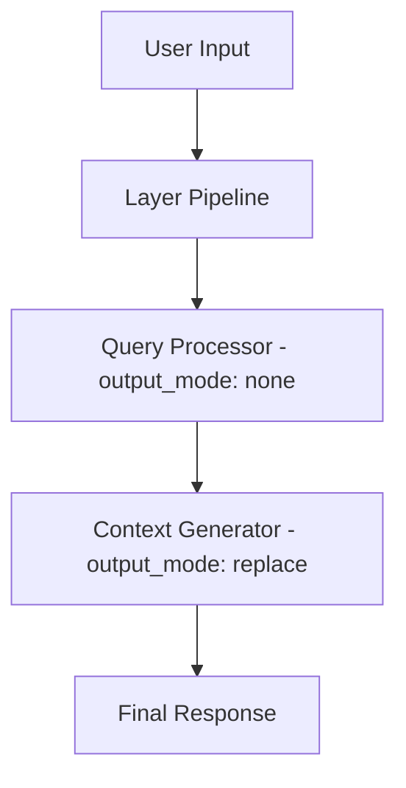

# Advanced Features Guide

## Overview

Octomind's advanced features enable sophisticated development workflows through MCP tool integration, layered AI architecture, and extensible configuration. This guide covers capabilities beyond basic session usage.

## MCP (Model-Centric Programming) Protocol

### What is MCP?

MCP enables AI models to use external tools and services through a standardized protocol. Octomind provides development capabilities through natural conversation by integrating tools seamlessly into AI interactions.

### MCP Protocol Compliance

**CRITICAL**: All Octomind MCP tools are fully protocol-compliant and handle errors gracefully:

- ✅ **Error Handling**: Tools return `McpToolResult::error()` instead of crashing communication
- ✅ **Parameter Validation**: Clear error messages for missing, empty, or wrong-type parameters
- ✅ **API Key Management**: Graceful handling of missing environment variables
- ✅ **Cancellation Support**: Proper handling of user cancellation requests
- ✅ **Standard Format**: All responses follow MCP standard: `{content: [{type: "text", text: "..."}], isError: true/false}`

### Built-in MCP Tools

Octomind provides two built-in MCP servers with core functionality:

**Core Server** (`src/mcp/core/`):
- `plan(command="start|step|next|list|done|reset", ...)` - Structured task management with progress tracking
- `mcp(action="list|add|enable|disable|remove", ...)` - Dynamic MCP server management
- `agent(action="list|add|enable|disable|remove", ...)` - Dynamic agent tool management
- `schedule(command="add|list|remove|edit", ...)` - Schedule messages for future injection
- `skill(action="list|use|forget", ...)` - Manage skills from taps (discover, inject, remove)

**External Filesystem Server** (octofs stdio):
Filesystem tools are provided by the external `octofs` MCP server:
- `view(path="...", lines=[start, end], pattern="...", content="...", ...)` - Read files, view directories, and search file content
- `text_editor(command="create|str_replace|undo_edit", path="...", ...)` - Create files or make targeted string replacements
- `batch_edit(path="...", operations=[...])` - Multiple insert/replace operations on a SINGLE file atomically, using ORIGINAL line numbers. Returns a detailed diff with line numbers and context.
- `extract_lines(from_path="...", from_range=[start, end], append_path="...", append_line=N)` - Extract and move code blocks
- `shell(command="...", background=false)` - Execute shell commands with output capture, foreground/background execution
- `workdir(path="...", reset=false)` - Get or set working directory for parallel execution isolation
- `ast_grep(pattern="...", language="...", rewrite="...", ...)` - Search and refactor code using AST patterns

**Agent Server** (`src/mcp/agent/`):
- `agent_*()` tools - Delegate tasks to configured ACP sub-agents (each spawns an ACP subprocess or executes in-process for dynamic agents)
---

### plan — Structured Task Management Tool

The `plan` tool enables interactive, step-by-step task management inside Octomind sessions. It supports workflow breakdown, progress tracking, and structured execution for complex development tasks.

**Purpose:**
- Break down large objectives into clear, actionable steps
- Track progress and provide visual feedback for each step
- Integrate seamlessly with session and MCP protocols

**Commands & Parameters:**
- `command` (string, required): One of the following commands:
  - **`start`**: Begin a new plan
    - `title` (string, required): Plan title
    - `tasks` (array of objects, required): List of subtasks with `title` and `description` fields
  - **`step`**: Add progress or notes to current step
    - `content` (string, required): Progress detail
  - **`next`**: Mark current step as complete and advance
    - `content` (string, required): Completion summary
  - **`list`**: Show all steps with completion status
  - **`done`**: Mark plan as complete and trigger session cleanup
    - `content` (string, optional): Final summary
  - **`reset`**: Abort and clear current plan

**Usage Example:**
```json
{"command": "start", "title": "Implement Feature X", "tasks": [{"title": "Design API", "description": "Create API endpoints"}, {"title": "Write tests", "description": "Unit and integration tests"}, {"title": "Implement logic", "description": "Core functionality"}]}
{"command": "step", "content": "Started API design..."}
{"command": "next", "content": "API designed, moving to tests"}
{"command": "list"}
{"command": "done", "content": "Feature implemented and tests passing"}
```

**MCP Compliance:**
- All errors use `Ok(McpToolResult::error(...))` (never `Err()`)
- Parameter validation is strict; missing/invalid params return actionable MCP error objects
- Output always includes `tool_id` and follows `{content: [{type: "text", text: "..."}], isError: ...}`
- Handles cancellation, session cleanup, and preserves MCP protocol integrity

**Session Integration:**
- `/done` triggers plan completion, summary, and memory cleanup
- Full progress is tracked for review and reporting

**Benefits:**
- Structured, sequential execution of complex tasks
- Visual progress feedback within session
- Clean error handling and robust MCP protocol support

### mcp — Dynamic MCP Server Management

The `mcp` tool allows you to manage MCP servers at runtime without editing the configuration file. This is useful for testing new servers or adding specialized tools temporarily.

**Actions:**
- **`list`**: Show all MCP servers (configured + dynamic) with status and persistence info.
- **`add`**: Register a new MCP server configuration (does NOT connect yet).
- **`enable`**: Connect to a registered server and activate its tools.
- **`disable`**: Deactivate a server's tools (configuration stays registered).
- **`remove`**: Unregister a server entirely.
- **`persist`**: Save a registered server to config dir. If enabled, auto-binds to current role. If disabled, clears auto_bind.
- **`unpersist`**: Remove a persisted server config file.

**Parameters:**
- `action` (string, required): `add`, `remove`, `enable`, `disable`, `list`, `persist`, `unpersist`
- `name` (string, optional): Unique name for the server
- `server_type` (string, optional): `stdio` or `http`
- `command` (string, optional): Executable to run (for `stdio`)
- `args` (array, optional): Arguments for the command (for `stdio`)
- `url` (string, optional): Server endpoint (for `http`)
- `auth_token` (string, optional): Bearer token for authentication (for `http`)
- `timeout_seconds` (number, optional): Server response timeout (default: 60)
- `tools` (array, optional): Which tools to expose (empty = all, supports wildcards like `github_*`)

### agent — Dynamic Agent Management

The `agent` tool allows you to manage specialized AI agents at runtime. These agents can be used as tools (prefixed with `agent_`) to delegate complex tasks.

**Actions:**
- **`list`**: Show all currently registered dynamic agents and their status.
- **`add`**: Register a new agent configuration (does NOT enable it yet).
- **`enable`**: Enable a registered agent (makes it available for execution).
- **`disable`**: Disable an agent (config stays registered).
- **`remove`**: Unregister an agent entirely.

**Parameters:**
- `action` (string, required): `add`, `remove`, `enable`, `disable`, `list`
- `name` (string, optional): Unique agent name (becomes tool: `agent_<name>`)
- `description` (string, optional): Human-readable description for the agent tool
- `system` (string, optional): System prompt for the agent (required for `add`)
- `welcome` (string, optional): Optional welcome message
- `model` (string, optional): Model override (e.g., 'openai:gpt-4')
- `temperature` (number, optional): Optional temperature override
- `top_p` (number, optional): Optional top_p override
- `top_k` (integer, optional): Optional top_k override
- `server_refs` (array, optional): MCP server references (config-defined or dynamic)
- `allowed_tools` (array, optional): Allowed tools filter (supports wildcards)
- `workdir` (string, optional): Working directory (default: '.')

### schedule — Scheduled Message Injection

The `schedule` tool allows you to schedule messages to be automatically injected as user messages into the current session at a future time. The session keeps running until all scheduled messages have fired.

**Commands:**
- **`add`**: Schedule a new message (requires `when` and `message`; `description` recommended)
- **`list`**: Show all pending scheduled entries with IDs, trigger times, and countdown
- **`remove`**: Cancel a scheduled entry by `id`
- **`edit`**: Update an existing entry by `id` (any of `when`, `message`, `description`)

**`when` format** (local timezone):
- **Relative**: `"in 5m"`, `"in 2h"`, `"in 1h30m"`, `"in 90s"`, `"in 2h 30m"`
- **Time today**: `"15:30"`, `"3:30pm"`, `"9am"` (if already past, fires tomorrow)
- **Exact datetime**: `"2026-03-22 15:30"`

**Parameters:**
- `command` (string, required): Action to perform (`add`, `list`, `remove`, `edit`)
- `when` (string, optional): When to fire. Required for `add`, optional for `edit`
- `message` (string, optional): The exact text injected verbatim as a user message when the timer fires. Required for `add`, optional for `edit`
- `description` (string, optional): Human-readable description shown in list output
- `id` (string, optional): Entry ID for `remove` and `edit` operations

**Key Features:**
- Each scheduled entry fires exactly once and is automatically removed after triggering
- To repeat a task, schedule it again after it fires
- The session keeps running until all scheduled messages have fired
- Maximum 8 concurrent async jobs; jobs cancelled on session exit

**Usage Example:**
```json
{"command": "add", "when": "in 30m", "message": "Check the build status", "description": "Build reminder"}
{"command": "list"}
**Skill Resources (Tier 3):**

Skills can include additional resources in subdirectories:
- `scripts/` — Executable scripts for the AI to run via `shell`
- `references/` — Documentation files for the AI to read via `view`
- `assets/` — Static files (images, data files, etc.)

When a skill is activated (`use` action), Octomind scans these directories and builds a **resource catalog** that lists all available resources with their absolute paths. The AI can then access these resources on demand using `shell` or `view` tools.

**Example skill directory:**
```
skills/code-review/
├── SKILL.md              # Skill instructions
├── scripts/
│   ├── lint.sh          # Run linter
│   └── test.sh          # Run tests
├── references/
│   ├── style-guide.md   # Coding standards
│   └── patterns.md      # Design patterns
└── assets/
    └── config.json      # Configuration template
```

**Resource catalog output:**
```markdown
## Skill Resources

**scripts/**
- `lint.sh` — /path/to/skills/code-review/scripts/lint.sh
- `test.sh` — /path/to/skills/code-review/scripts/test.sh

**references/**
- `style-guide.md` — /path/to/skills/code-review/references/style-guide.md
- `patterns.md` — /path/to/skills/code-review/references/patterns.md

**assets/**
- `config.json` — /path/to/skills/code-review/assets/config.json
```

The AI reads this catalog and can execute scripts or read references as needed.

{"command": "remove", "id": "entry-123"}
{"command": "edit", "id": "entry-123", "when": "in 1h"}
```

### skill — Skill Management from Taps

The `skill` tool manages skills from taps. Skills are reusable instruction packs that inject domain knowledge into context.

**Actions:**
- **`list`**: Discover available skills across all taps. Supports optional `pattern` (substring filter), `offset`, and `limit` (default 20)
- **`use`**: Inject a skill's full content into the current session context. The skill instructions become immediately active
- **`forget`**: Remove a skill from context. Triggers conversation compression to clean up the injected content

**Parameters:**
- `action` (string, required): Action to perform (`list`, `use`, `forget`)
- `name` (string, optional): Skill name (required for `use` and `forget` actions)
- `pattern` (string, optional): Substring filter for skill name/description (for `list` action)
- `offset` (integer, optional): Pagination offset for `list` action (default: 0)
- `limit` (integer, optional): Maximum results for `list` action (default: 20)

**Workflow:**
1. `skill(action="list")` to explore available skills
2. `skill(action="use", name="skill-name")` to activate a skill
3. `skill(action="forget", name="skill-name")` when the skill is no longer needed

**Adding a Tool/Server:**
- Add your tool/server in config and code (see [08-mcp-server-development.md](./08-mcp-server-development.md))
- Always use config for registration, server_refs, allowed_tools

#### shell — Shell Command Execution

Execute shell commands with output capture, foreground/background execution:

```json
// Foreground execution (default)
{"command": "ls -la"}

// Background execution
{"command": "python -m http.server 8000", "background": true}
// Returns: {"success": true, "background": true, "pid": 12345, "message": "...", "note": "Use 'kill 12345' to terminate..."}

// Kill background process
{"command": "kill 12345"}
```

**Parameters:**
- `command` (string, required): The shell command to execute
- `background` (boolean, default: false): Run command in background and return PID instead of waiting for completion

**Key Features:**
- Working directory: All commands execute from the current working directory
- Background mode: Returns process PID for later termination with `kill <pid>`
- Output control: Large outputs are controlled by `mcp_response_tokens_threshold` setting

#### workdir — Manage Working Directory

Get or set the working directory for file and shell operations:

```json
// Get current working directory
{}

// Set new working directory
{"path": "/path/to/directory"}

// Reset to original project directory
{"reset": true}
```

**Parameters:**
- `path` (string, optional): Path to set as new working directory. Can be absolute or relative to current working directory.
- `reset` (boolean, default: false): If true, reset to original project directory (ignores `path` parameter).

**Key Features:**
- Parallel execution: Each actor can work in its own isolated git worktree
- Testing: Switch to a test directory before running tests
- Multi-project workflows: Work across multiple related projects
- Thread-local: Changes only affect the current thread/session

**Use Cases:**
```json
// Get current directory
{}

// Switch to test directory
{"path": "tests/"}

// Work in a git worktree
{"path": "/path/to/worktree"}

// Reset to project root
{"reset": true}
```

**ast_grep** - Search and refactor code using AST patterns with ast-grep (sg)
- **Structural search**: Use AST patterns instead of regex for precise code matching
- **Code refactoring**: Apply transformations using rewrite patterns
- **Multi-language support**: JavaScript, TypeScript, PHP, Rust, Python, Go, Java, C/C++
- **Context-aware output**: Configurable context lines around matches

```json
// Search for console.log calls
{"pattern": "console.log($$$)", "language": "javascript"}

// Rename function calls
{"pattern": "oldFunc($ARGS)", "rewrite": "newFunc($ARGS)", "language": "javascript"}

// Search specific files with context
{"pattern": "class $NAME", "language": "php", "paths": ["src/**/*.php"], "context": 2}
```

**Parameters:**
- `pattern` (string, required): The AST pattern to search for using ast-grep syntax
- `paths` (array, optional): File paths or glob patterns to search within (default: current directory)
- `language` (string, optional): Language of the code (e.g., 'rust', 'javascript', 'python', 'typescript', 'go', 'java', 'c', 'cpp', 'php')
- `rewrite` (string, optional): Rewrite pattern to apply for refactoring transformations
- `json_output` (boolean, default: false): Get output in JSON format
- `context` (integer, default: 0): Number of lines of context to show around matches
- `update_all` (boolean, default: false): Apply rewrites to all matches without confirmation


#### Filesystem Tools (type: "builtin")
- **view**: Read files, view directories, and search file content with pattern matching
- **text_editor**: Edit files with multiple operations (create, str_replace, undo_edit)
- **extract_lines**: Extract lines from source file and append to target file without modifying source (perfect for refactoring)
- **batch_edit**: Multiple file operations atomically

### Agent Tools Reference

The agent system enables task delegation to specialized AI agents. Agents can be configured in the configuration file or managed dynamically at runtime. Each agent becomes a separate MCP tool (prefixed with `agent_`) that either spawns an ACP subprocess or executes in-process for dynamic agents.

#### How It Works

1. **Configure Agents**: Define agents in `[[agents]]` with a `name`, `description`, and `command`
2. **Use Agent Tools**: Each agent becomes a tool like `agent_context_gatherer`, `agent_code_reviewer`, etc.
3. **ACP Subprocess**: When called, Octomind spawns the `command` as a child process and talks JSON-RPC over stdio
4. **Result**: The agent's final response (all `agent_message_chunk` text) is returned as the tool output

#### Agent Configuration

Agents are defined in the `[[agents]]` section with a minimal structure — just point `command` at any ACP-compatible server:

```toml
# Built-in context gatherer — uses the context_gatherer role
[[agents]]
name = "context_gatherer"
description = "Gather detailed context from files and codebase. Reads files, searches code patterns, and provides comprehensive information about specific areas of the codebase for development tasks."
command = "octomind acp --role context_gatherer"
workdir = "."  # Working directory for agent execution (default: current directory)

# Example: Architect Agent
# [[agents]]
# name = "architect"
# description = "Design system architecture and evaluate technical decisions."
# command = "octomind acp --role architect"
# workdir = "."

# Example: Code Reviewer Agent
# [[agents]]
# name = "code_reviewer"
# description = "Review code for quality, best practices, security issues, and performance problems."
# command = "octomind acp --role code_reviewer"
# workdir = "."
```

**Fields:**
- `name` (string, required): Unique identifier — exposed as MCP tool `agent_<name>`
- `description` (string, required): Shown as the MCP tool description to the AI
- `command` (string, required): Shell command that starts an ACP server over stdio (e.g. `octomind acp --role developer`)
- `workdir` (string, optional, default `"."` ): Working directory for the subprocess. Relative paths resolve from the session's working directory.

#### Usage Examples

Once configured, each agent becomes a separate tool:

```bash
# In session
agent_context_gatherer(task="Analyze the authentication system architecture and gather all relevant files and patterns")
agent_code_reviewer(task="Review this function for performance issues and suggest improvements")
```

#### Tool Parameters

Each agent tool accepts two parameters:

- `task` (string, required): Task description in human language for the agent to process
- `async` (boolean, optional, default: false): Run asynchronously and return immediately

#### Async Execution

**async: false** (default) — Blocks until complete. Use when you need the result immediately.

**async: true** — Returns immediately, runs asynchronously. Result appears as a user message when complete.

**When to use async:**
- Task takes 30+ seconds (large codebase analysis, multi-file refactoring)
- You can continue other work while waiting
- You don't need the result for your next immediate action

**When NOT to use async:**
- You need the result to make your next decision
- Quick tasks (under 30 seconds)
- Multi-step tasks where each step depends on the previous result

**Result format:** `[Async agent 'name' completed]` or `[Async agent 'name' failed]`

**Limits:** Max concurrent async jobs configurable via `background_jobs.max_concurrent_jobs`. Jobs are cancelled on session exit/interrupt (Ctrl+C, /exit). Non-interactive sessions wait for all async jobs before exiting.

#### Key Features

- **ACP Protocol**: Each agent call spawns a real subprocess and drives the full ACP handshake
- **Any ACP Server**: `command` can point to any ACP-compatible binary, not just Octomind
- **Individual Tools**: Each agent becomes a separate MCP tool (e.g., `agent_context_gatherer`)
- **Isolated Execution**: Each call runs in its own subprocess with its own session
- **Required Description**: `description` is required — it becomes the MCP function description shown to the AI

### Text Editor Tool Reference

The `text_editor` tool provides comprehensive file manipulation capabilities through multiple commands:

#### Individual Operations

**view** - Examine file contents or directory listings
```json
{"command": "view", "path": "src/main.rs"}
{"command": "view", "path": "src/main.rs", "view_range": [10, 20]}
{"command": "view", "path": "src/"}
```

**create** - Create new files with content
```json
{"command": "create", "path": "src/new_module.rs", "file_text": "pub fn hello() {\n    println!(\"Hello!\");\n}"}
```

**str_replace** - Replace specific strings in files
```json
{"command": "str_replace", "path": "src/main.rs", "old_str": "fn old_name()", "new_str": "fn new_name()"}
```

**insert** - Insert text at specific line positions
```json
{"command": "insert", "path": "src/main.rs", "insert_line": 5, "new_str": "// New comment\nlet x = 10;"}
```

**line_replace** - Replace content within specific line ranges
```json
{"command": "line_replace", "path": "src/main.rs", "view_range": [5, 8], "new_str": "fn updated_function() {\n    // New implementation\n}"}
```
- **Remove lines**: Use empty `new_str` ("") to remove lines completely
- **Refactoring workflow**: Extract code with `extract_lines`, then remove original with `line_replace` + empty `new_str`

**extract_lines** - Extract lines from source file and append to target file
```json
{"from_path": "src/utils.rs", "from_range": [10, 25], "append_path": "src/extracted.rs", "append_line": -1}
```
- **Parameters**:
  - `from_path`: Source file to extract from
  - `from_range`: [start, end] line numbers (1-indexed, inclusive)
  - `append_path`: Target file (auto-created if needed)
  - `append_line`: Insert position (0=beginning, -1=end, N=after line N)
- **Perfect for refactoring**: Move code blocks between files without modifying source

**undo_edit** - Revert the most recent edit
```json
{"command": "undo_edit", "path": "src/main.rs"}
```

**view_many** - View multiple files simultaneously
```json
{"command": "view_many", "paths": ["src/main.rs", "src/lib.rs", "tests/test.rs"]}
```

#### Batch Operations

**batch_edit** - Perform multiple editing operations in a single call
```json
### batch_edit — Atomic Multi-Line Editing

The `batch_edit` tool allows performing multiple insert or replace operations on a single file atomically. It uses original line numbers, meaning all operations refer to the file state before any changes were applied.

**Parameters:**
- `path` (string, required): Path to the file to edit
- `operations` (array, required): List of operations to perform:
  - `operation` (string): `insert` (after line) or `replace` (line range)
  - `line_range` (integer or array): Single line number for `insert`, or `[start, end]` for `replace`
  - `content` (string): Raw content to insert or replace with

**Usage Example:**
```json
{
  "path": "src/main.rs",
  "operations": [
    {
      "operation": "replace",
      "line_range": [10, 12],
      "content": "fn new_function() {\n    println!(\"Updated\");\n}"
    },
    {
      "operation": "insert",
      "line_range": 20,
      "content": "// New comment after line 20"
    }
  ]
}
```

**Key Features:**
- **Atomic execution**: All changes are applied together or not at all
- **Original line numbers**: No need to track line shifts between operations
- **Diff output**: Returns a standard diff showing exactly what changed
- **Safety**: Validates line ranges and content before applying

**Note**: `extract_lines` is not supported in batch operations as it's a standalone tool for file-to-file extraction.

**When to Use Batch Edit:**
- ✅ **Multiple file refactoring** - Rename functions across files
- ✅ **Consistent changes** - Apply same pattern to multiple files
- ✅ **Independent modifications** - Changes that don't depend on each other
- ✅ **Bulk updates** - Update imports, comments, or configuration
- ❌ **Sequential dependencies** - When changes depend on previous results
- ❌ **Complex logic** - When you need conditional modifications

### MCP Server Configuration

The MCP system uses a centralized server configuration in the main `[mcp]` section:

```toml
# MCP Server Configuration - Define servers once, reference everywhere
[mcp]
allowed_tools = []

# Built-in server definitions (always available)
[[mcp.servers]]
name = "core"
type = "builtin"
timeout_seconds = 30
tools = []

[[mcp.servers]]
name = "agent"
type = "builtin"
timeout_seconds = 30
tools = []

# External filesystem server (octofs stdio)
# Provides: view, text_editor, batch_edit, extract_lines, shell, workdir, ast_grep
[[mcp.servers]]
name = "filesystem"
type = "stdio"
command = "octofs"
args = []
timeout_seconds = 30
tools = []

# External HTTP server example
[[mcp.servers]]
name = "external_tools"
type = "http"
url = "https://mcp.so/server/custom-tools"
auth_token = "optional_token"
timeout_seconds = 30
tools = []

# External command-based server example
[[mcp.servers]]
name = "local_tools"
type = "stdin"
command = "python"
args = ["-m", "my_mcp_server", "--port", "8008"]
timeout_seconds = 30
tools = ["custom_tool1", "custom_tool2"]  # Only these tools enabled
```

### Role-Based Server Access

Roles reference servers from the main MCP configuration and can limit tool access:

```toml
# Developer role with full access
[[roles]]
name = "developer"
[roles.mcp]
server_refs = ["core", "filesystem", "agent"]
allowed_tools = ["core:*", "filesystem:*", "agent:*"]
### Server Types

- **core**: Built-in core tools
  - `plan`: Structured task management with progress tracking
  - `mcp`: Dynamic MCP server management
  - `agent`: Dynamic agent tool management
  - `schedule`: Schedule messages for future injection
  - `knowledge_search`: Search indexed web knowledge
  - `tavily_*`: Web search and extraction tools
  - `remember`, `memorize`, `forget`, `relate`, `auto_link`, `memory_graph`: Memory management
- **agent**: Built-in agent delegation
  - `agent_*`: Delegate tasks to configured ACP sub-agents
- **filesystem**: External filesystem server (octofs stdio)
  - `view`: Read files, view directories, and search file content
  - `text_editor`: Comprehensive file editing with batch operations
  - `batch_edit`: Atomic multi-line editing
  - `extract_lines`: Extract and move code blocks
  - `shell`: Terminal command execution
  - `workdir`: Working directory management
  - `ast_grep`: AST-based code search and refactoring
- **external**: External MCP servers (HTTP or stdio)
  - Custom tools from third-party servers


### External MCP Servers

#### HTTP-based Servers
```toml
[[mcp.servers]]
name = "custom_api"
type = "http"
url = "https://api.example.com/mcp"
auth_token = "your_token"
timeout_seconds = 30
tools = []
```

#### Command-based Servers
```toml
[[mcp.servers]]
name = "custom_tools"
type = "stdin"
command = "python"
args = ["/path/to/mcp_server.py"]
timeout_seconds = 30
```

## Layered Architecture

### Overview

For complex development tasks, Octomind uses a flexible multi-stage AI processing system where each layer is fully configurable through the configuration file. All layers use the same `GenericLayer` implementation with different configurations.



### Layer Configuration System

All layers are configured through the `[[layers]]` section in your configuration file. Each layer supports:

- **Input Mode**: How the layer receives input (`last`, `all`)
- **Output Mode**: How the layer affects the session (`none`, `append`, `replace`)
- **Model Selection**: Specific model for this layer
- **MCP Tools**: Which tools the layer can access
- **Custom Prompts**: Layer-specific system prompts

#### Output Modes Explained

- **`none`**: Intermediate layer that doesn't modify the session (like task_refiner)
- **`append`**: Adds layer output as a new message to the session
- **`replace`**: Replaces the entire session content with the layer output

**Context Management Commands:**
- **`/done`**: Task completion using current model - comprehensive summarization with memorization and auto-commit

### Built-in Layer Types

#### Query Processor
- **Purpose**: Analyze and improve user requests
- **Configuration**: `output_mode = "none"` (intermediate processing)
- **Default Model**: Fast, cost-effective model for text analysis

#### Context Generator
- **Purpose**: Gather project context and prepare comprehensive responses
- **Configuration**: `output_mode = "replace"` (replaces input with enriched context)
- **Default Model**: Balanced model with tool access for code analysis

#### Reducer
- **Purpose**: Optimize and compress session history
- **Configuration**: `output_mode = "replace"` (replaces session with compressed content)
### Layered Architecture Configuration

All layers are configured through the `[[layers]]` section with consistent parameters:

```toml
[developer]
enable_layers = true

# All layers use the same GenericLayer implementation with different configurations

[[layers]]
name = "task_refiner"
model = "openrouter:openai/gpt-4.1-mini"
temperature = 0.2
input_mode = "Last"
output_mode = "none"  # Intermediate layer - doesn't modify session
builtin = true

[layers.mcp]
server_refs = []
allowed_tools = []

[[layers]]
name = "task_researcher"
model = "openrouter:google/gemini-2.5-flash-preview"
temperature = 0.2
input_mode = "Last"
output_mode = "replace"  # Replaces input with processed context
builtin = true

[layers.mcp]
server_refs = ["core", "filesystem", "octocode"]
allowed_tools = ["view"]
[[layers]]
name = "reducer"
model = "openrouter:openai/o4-mini"
temperature = 0.2
input_mode = "All"
output_mode = "replace"  # Replaces entire session with reduced content
builtin = true

[layers.mcp]
server_refs = []
allowed_tools = []
```

### Custom Layer Configuration

You can create custom layers with any combination of settings:

```toml
[[layers]]
name = "code_reviewer"
model = "openrouter:anthropic/claude-sonnet-4"
system_prompt = "You are a senior code reviewer..."
temperature = 0.1
input_mode = "Last"
output_mode = "append"  # Add review results to session
builtin = false

[layers.mcp]
server_refs = ["core", "filesystem"]
allowed_tools = ["text_editor", "view"]
```


```toml
[[layers]]
name = "developer"
enabled = true
model = "openrouter:anthropic/claude-sonnet-4"
temperature = 0.3
enable_tools = true
input_mode = "all"
```

### Session Commands for Workflows

- `/workflow [name]` - Execute workflows (list available with /workflow)
- `/done` - Manually trigger context optimization
- `/info` - View token usage by layer


## Token Management

### Conversation Compression System

Octomind features an intelligent conversation compression system that automatically manages token limits by compressing older conversation exchanges while preserving recent context.

#### Architecture

The compression system is located in:
- **`src/session/chat/conversation_compression.rs`**: Core compression logic
- **`src/session/chat/session/core.rs`**: Session state management
- **`src/session/chat/response.rs`**: Integration point for compression checks

#### How It Works

1. **Token Monitoring**: Every response processing checks against configured pressure levels (50k, 100k, 150k tokens)
2. **AI Decision**: AI decides whether compression is beneficial (self-reflection)
3. **Context Preservation**: Last 4 turns (2 exchanges) remain uncompressed for continuity
4. **Cache-Aware**: Calculates net benefit considering cache invalidation costs
5. **Compression**: Older exchanges are summarized using plan compression infrastructure

```toml
[compression]
# Enable compression hints
hints_enabled = true

# Pressure levels - compress when threshold exceeded
[[compression.pressure_levels]]
threshold = 50000
name = "light"
target_ratio = 2.0

[[compression.pressure_levels]]
threshold = 100000
name = "medium"
target_ratio = 4.0

[[compression.pressure_levels]]
threshold = 150000
name = "heavy"
target_ratio = 8.0

# Maximum critical knowledge retained across compressions
knowledge_retention = 10

# Fallback: compress when this limit is reached (0 = disabled)
max_session_tokens_threshold = 50000
```

#### Features

**AI-Driven Decision:**
- AI self-reflects on whether compression is beneficial
- Considers cache invalidation costs vs future savings
- Only compresses when it saves money

**Context Preservation:**
- Last 4 turns (2 exchanges) always remain uncompressed
- Maintains conversation continuity
- Preserves recent context for ongoing work

**Performance Optimization:**
- Cache-aware economics calculation
- Efficient compression using plan infrastructure
- Visual feedback when compression occurs

**Integration Points:**
- Works during any token-consuming operation
- Integrates with existing cache and cost tracking systems
- Maintains session state consistency

- `/info` - Display token usage and cost breakdown

## Smart Adaptive Compression System

Octomind features an intelligent compression system that automatically reduces conversation context when token usage grows, while maintaining cost-effectiveness through cache-aware decision making and discourse-aware semantic chunking.

### Architecture

The compression system is implemented across multiple modules:

**Core Compression:**
- **`src/session/chat/conversation_compression.rs`**: Main compression engine with cache-aware economics, semantic chunking, and AI-driven decision making
- **`src/session/cache.rs`**: Cache marker management system (2-marker system for cost optimization)
- **`src/mcp/core/plan/compression.rs`**: Plan-specific compression for structured task workflows

**Supporting Systems:**
- **`src/session/chat/semantic_chunking.rs`**: Discourse-aware semantic chunking for preserving conversation structure
- **`src/session/chat/token_counter.rs`**: Unified token counting for all message fields (content, tool_calls, thinking, images)

### How Compression Works

Compression operates through three key mechanisms:

#### 1. Token-Based Triggers with Exponential Cooldown

Octomind uses **absolute token count thresholds** with **exponential cooldown** to prevent futile compression loops:

**Threshold-Based Ratio Selection:**
```
Token Count → Compression Strength
50,000 tokens → 2.0x compression (50% reduction)
100,000 tokens → 4.0x compression (75% reduction)
150,000 tokens → 8.0x compression (87.5% reduction)
```

**Exponential Cooldown Mechanism:**
Each consecutive compression (without a user message) doubles the required token growth before re-compression is allowed:

```
Consecutive Compressions → Required Growth
1st compression → 10% token growth required
2nd compression → 20% token growth required
3rd compression → 40% token growth required
4th+ compression → 80-100% token growth required (capped at 100%)
```

This prevents compression loops during tool-call chains where context temporarily grows then shrinks.

The system monitors `session.get_full_context_tokens(config)` which includes:
- All conversation messages
- System prompt
- Tool definitions
- Safety margin for response generation
#### 2. Cache-Aware Decision Making

Before compressing, the system calculates if compression saves money by analyzing the net benefit:

```rust
// Actual calculation from calculate_compression_net_benefit()
net_benefit = (
    // Cost of current turn with full context
    current_tokens * current_model_cost

    // Plus: cost of remaining turns with full context
    + estimated_remaining_turns * current_tokens * current_model_cost

    // Minus: cost of compression (AI decision + summary)
    - compression_cost

    // Minus: cost of cache invalidation (forced rewrite at 1.25x)
    - (compressed_tokens * 1.25 * current_model_cost)

    // Plus: savings from smaller context in future turns
    + estimated_remaining_turns * (current_tokens - compressed_tokens) * current_model_cost

    // Plus: cache read savings (0.1x cost for cached content)
    + estimated_remaining_turns * compressed_tokens * 0.1 * current_model_cost
)

if net_benefit > 0.0 {
    compress()  // Saves money
} else {
    skip()      // Would cost money
}
```

**Cost Analysis Factors:**

- **Cache Write Cost**: 1.25x base token cost (Anthropic 5-minute TTL standard)
- **Cache Read Cost**: 0.1x base token cost (90% savings on cached content)
- **Compression Cost**: AI decision + summarization (typically 2-3k tokens)
- **Cache Invalidation**: Compression invalidates existing cache, forcing rewrite at 1.25x cost
- **Future Savings**: Smaller context = lower costs for all remaining conversation turns

**Future Turn Estimation:**

The system estimates remaining conversation turns using `estimate_future_turns()` with velocity-based analysis:

```
// Bootstrap phase (< 5 API calls)
if current_api_calls < 5:
    return 10.0  // Conservative baseline

// Calculate session metrics
session_duration_mins = (current_time - session_start) / 60
call_velocity = current_api_calls / session_duration_mins  // calls per minute

// Estimate remaining time based on session age
continuation_factor = {
    < 10 min:  0.8  // Early session: 80% more time likely
    < 30 min:  0.6  // Mid session: 60% more time likely
    >= 30 min: 0.4  // Long session: 40% more time (winding down)
}
estimated_remaining_mins = session_duration_mins * continuation_factor

// Apply velocity decay (sessions slow down over time)
velocity_decay = {
    > 2.0 calls/min: 0.6   // High velocity: expect 40% slowdown
    > 1.0 calls/min: 0.75  // Medium velocity: expect 25% slowdown
    <= 1.0 calls/min: 0.85 // Low velocity: expect 15% slowdown
}

// Calculate future calls
estimated_remaining = call_velocity * estimated_remaining_mins * velocity_decay

// Apply data-driven bounds
max_estimate = min(current_api_calls * 2.0, 100.0)
final_estimate = clamp(estimated_remaining, 5.0, max_estimate)
```

**Key characteristics:**
- Uses actual session velocity (calls/minute) instead of arbitrary assumptions
- Accounts for session lifecycle (early/mid/late phases)
- Applies realistic decay factors (sessions slow down over time)
- Bounded by historical data: minimum 5 calls, maximum 2x current calls or 100 calls
- Bootstrap phase uses conservative 10-call estimate until sufficient data available

This velocity-based approach ensures compression decisions reflect actual session behavior and account for the full cost-benefit over the session's expected lifetime.

#### 3. Discourse-Aware Semantic Chunking

Compression uses semantic chunking to preserve important information:

- **Preserves last 4 turns uncompressed**: Maintains recent context continuity
- **Semantic grouping**: Groups related messages for coherent compression
- **Importance weighting**: Prioritizes recent and tool-related messages
- **Discourse flow**: Maintains conversation structure and reasoning chains

### Configuration

```toml
[compression]
# Enable compression hints
hints_enabled = true
hints_pressure_threshold = 0.7
hints_min_interval = 5

# Compression triggers at these token thresholds
[[compression.pressure_levels]]
threshold = 50000
target_ratio = 2.0  # Light: 50% reduction

[[compression.pressure_levels]]
threshold = 100000
target_ratio = 4.0  # Medium: 75% reduction

[[compression.pressure_levels]]
threshold = 150000
target_ratio = 8.0  # Aggressive: 87.5% reduction

# Maximum critical knowledge retained across compressions
knowledge_retention = 10

# Optional: Use cheaper model for compression decisions
# Recommended: "anthropic:claude-haiku-4-5" (10x cheaper)
# decision_model = "anthropic:claude-haiku-4-5"
```

### Compression in Action

#### Example 1: Profitable Compression

```
Session state: 95,000 tokens
Threshold matched: 100,000 (target_ratio: 4.0x)

Cache-aware analysis:
  Current tokens: 95,000
  Estimated remaining turns: 5

  Without compression:
    5 turns × 95,000 tokens = 475,000 tokens
    Cost: 475,000 × $0.003 = $1.425

  With compression:
    Cache invalidation: 95,000 × 0.0025 = $0.2375
    Compressed size: 95,000 ÷ 4 = 23,750 tokens
    5 turns × 23,750 tokens = 118,750 tokens
    Cost: 118,750 × $0.003 = $0.3563
    Total: $0.2375 + $0.3563 = $0.5938

  Net benefit: $1.425 - $0.5938 = $0.8312 ✓ COMPRESS
```

#### Example 2: Skipped Compression

```
Session state: 55,000 tokens
Threshold matched: 50,000 (target_ratio: 2.0x)

Cache-aware analysis:
  Current tokens: 55,000
  Estimated remaining turns: 1

  Without compression:
    1 turn × 55,000 tokens = 55,000 tokens
    Cost: 55,000 × $0.003 = $0.165

  With compression:
    Cache invalidation: 55,000 × 0.0025 = $0.1375
    Compressed size: 55,000 ÷ 2 = 27,500 tokens
    1 turn × 27,500 tokens = 27,500 tokens
    Cost: 27,500 × $0.003 = $0.0825
    Total: $0.1375 + $0.0825 = $0.22

  Net benefit: $0.165 - $0.22 = -$0.055 ✗ SKIP (would cost money)
```

### Monitoring Compression

Use `/info` command to see compression statistics:

```
Compression Statistics:
  Total compressions: 3
  Average reduction: 72.5%
  Total tokens saved: 45,000
  Cost saved: $0.045

  Last compression:
    Before: 98,500 tokens
    After: 24,625 tokens (4.0x compression)
    Cost saved: $0.0225
```

### Compression Statistics in /info

The `/info` command displays:

```
Session Cost Report:
  ...
  Compression Statistics:
    Total compressions: 2
    Average reduction: 65%
    Tokens saved: 18,000
    Cost saved: $0.054
```

### Best Practices

1. **Monitor effectiveness**: Use `/info` to verify compression is saving money
2. **Use decision models**: Set `decision_model` to cheaper model for significant savings
3. **Adjust thresholds**: Start conservative (50k), adjust based on your workflow
4. **Preserve context**: Compression preserves last 4 turns for continuity
5. **Consider session length**: Disable compression if sessions are typically short

### Troubleshooting Compression
**Compression not triggering:**
- Verify `pressure_levels` array is not empty
- Check that `hints_enabled = true` (default)
- Use `/info` to see current token count vs. thresholds

**Compression too aggressive:**
- Lower `target_ratio` values (e.g., 2.0 instead of 4.0)
- Increase `threshold` values (e.g., 75,000 instead of 50,000)

**Compression not saving money:**
- Enable `decision_model` for cheaper decisions
- Increase thresholds to compress less frequently
- Consider disabling if sessions are short

### Integration with Token Management

Compression works with other token management features:

1. **Caching** reduces costs for repeated context
2. **Compression** reduces context size at pressure thresholds
3. **Combined effect**: Longer sessions with lower costs

Example flow:
```
Session grows → Compression triggers → Context reduced
Session grows again → Compression triggers again → Context reduced further
Session reaches limit → Compression at highest ratio
```

### Multi-Provider Setup
```toml
# Use different providers for different purposes
[developer]
model = "openrouter:anthropic/claude-sonnet-4"  # Main development
# Layer models are configured in individual [[layers]] sections
# See the layers configuration examples above for model assignments

[assistant]
model = "openrouter:anthropic/claude-3.5-haiku"  # Lightweight chat
```

### Role-Specific Tool Access
```toml
# Security-focused role
[security-reviewer]
model = "openrouter:anthropic/claude-sonnet-4"
enable_layers = true

[security-reviewer.mcp]
enabled = true
server_refs = ["core", "filesystem"]
allowed_tools = ["text_editor", "shell"]  # Limited tools for security focus

# Documentation role
[docs-writer]
model = "openrouter:openai/gpt-4o"
enable_layers = false

[docs-writer.mcp]
enabled = true
server_refs = ["filesystem"]
allowed_tools = ["text_editor"]  # Only doc-related tools
```

### External Tool Integration
[custom-dev]
model = "openrouter:anthropic/claude-sonnet-4"

[custom-dev.mcp]
enabled = true
server_refs = ["core", "filesystem", "custom_tools"]

# Add custom MCP server
[[mcp.servers]]
name = "custom_tools"
type = "http"
url = "https://mcp.so/server/custom-tools"
timeout_seconds = 30
tools = []
### OAuth 2.1 + PKCE Authentication for External Servers

HTTP MCP servers can be secured with OAuth 2.1 + PKCE (Proof Key for Code Exchange) authentication:

```toml
# HTTP MCP server with OAuth 2.1 + PKCE authentication
[[mcp.servers]]
name = "github_mcp"
type = "http"
url = "https://api.github.com/mcp"
timeout_seconds = 30
tools = []

# OAuth configuration
[mcp.servers.oauth]
client_id = "your-oauth-client-id"
client_secret = "your-oauth-client-secret"
authorization_url = "https://github.com/login/oauth/authorize"
token_url = "https://github.com/login/oauth/access_token"
callback_url = "http://localhost:34567/oauth/callback"
scopes = ["repo", "read:org"]
```

**How OAuth Flow Works:**
1. When Octomind connects to the server, it initiates OAuth flow
2. User is directed to authorization URL in browser
3. After authorization, token is exchanged and stored
4. Subsequent requests use the OAuth token automatically

**Benefits:**
- Secure authentication without storing credentials
- User-controlled authorization
- Automatic token refresh
- Support for multiple OAuth providers


## Session Management

### Session Persistence
- **Save sessions**: All conversations are automatically saved
- **Resume sessions**: Continue where you left off
- **Session switching**: Work on multiple projects simultaneously

### Session Commands
```bash
# In any session
/help              # Show all available commands
/list              # List all sessions
/session [name]    # Switch to another session
/save              # Manually save current session
/model [model]     # Change AI model
/clear             # Clear screen
/exit              # Exit session
```

### Session Organization
```bash
# Start named sessions for different purposes
octomind run --name "feature-auth"
octomind run --name "bugfix-login"
octomind run --name "refactor-api"

# Resume specific sessions
octomind run --resume "feature-auth"
```

## Development Workflow Integration

### Project Context Collection
Sessions automatically analyze:
- **Project structure** and organization
- **Configuration files** and build systems
- **Documentation** and README files
- **Git repository** information

### Natural Development Tasks
Instead of complex commands, simply ask:
- **"How does authentication work?"** - AI analyzes auth code
- **"Add logging to the login function"** - AI implements logging
- **"Why is the build failing?"** - AI checks build errors
- **"Refactor this function"** - AI improves code structure

### Code Analysis Capabilities
Through natural conversation:
- **File exploration**: "Show me the main configuration files"
- **Code understanding**: "Explain how this module works"
- **Pattern finding**: "Find all error handling patterns"
- **Dependency analysis**: "What files import this module?"

## Performance Optimization

### Model Selection Strategy
1. **Fast models** for simple analysis (Query Processor)
2. **Balanced models** for information gathering (Context Generator)
3. **Powerful models** for complex development tasks (Developer)

### Tool Usage Optimization
- **Batch operations**: Use `view` for reading multiple files, `batch_edit` for modifying multiple files
- **Specific patterns**: Use `view` with patterns to filter results

### Context Management
- **Auto-truncation**: Enable for long sessions
- **Task completion**: Use `/done` to finalize tasks with memorization and commit
- **Token monitoring**: Use `/info` to track usage

## Troubleshooting

### Common Issues

#### MCP Configuration Problems
```bash
# Validate configuration
octomind config --validate

# Check MCP server connectivity
# (Server status is checked automatically when tools are used)
```

#### Tool Access Issues
- **Check role configuration**: Ensure server_refs include needed servers
- **Verify tool permissions**: Check allowed_tools list
- **External server issues**: Verify URL and authentication

#### Workflow Performance Issues
```bash
# Monitor workflow performance
/info

# List available workflows
/workflow

# Optimize context
/done
```

```

#### Token Limit Issues
```bash
# Check current usage
/info

# Optimize context manually
/done
```

### Debug Mode
```bash
# Enable debug logging in session
/loglevel debug

# Or in configuration
log_level = "debug"
```

## Best Practices

### MCP Usage
1. **Start with built-in servers** before adding external ones
2. **Limit tool access** in specialized roles for security
3. **Test external servers** thoroughly before deployment
4. **Monitor tool performance** through session feedback

### Layered Architecture
1. **Enable for complex tasks** that benefit from specialized processing
2. **Use appropriate models** for each layer's complexity
3. **Monitor token usage** across layers with `/info`
4. **Optimize context** regularly with `/done`

### Session Management
1. **Use descriptive names** for sessions
2. **Save important sessions** manually when needed
3. **Switch sessions** for different projects or tasks
4. **Monitor token usage** to control costs

### Development Workflow
1. **Ask natural questions** instead of trying to construct complex commands
2. **Be specific** about what you want to accomplish
3. **Use session commands** to manage context and performance
4. **Leverage auto-analysis** by letting sessions examine your project structure

## Migration from Legacy Configuration

### MCP Migration
**Old format:**
```toml
[mcp]
enabled = true
providers = ["core"]
```

## Unified Inbox System

Octomind uses a session-scoped unified inbox for all message injection sources. This replaces multiple ad-hoc mechanisms with a single, thread-safe queue.

### Architecture

The unified inbox (`src/session/inbox.rs`) provides:

**Single Queue Per Session:**
- Thread-safe `RwLock<HashMap<SessionId, InboxQueue>>`
- Each session has its own isolated message queue
- `InboxQueue` contains messages and a `Notify` for wakeup signaling

**Message Sources:**
- **Schedule**: Scheduled messages from the `schedule` tool
- **BackgroundAgent**: Completed background agent jobs
- **Skill**: Skill activations requiring content injection
- **Inject**: External injection via `octomind inject` CLI command
- **Webhook**: HTTP webhook requests

### API

```rust
// Lifecycle management
init_inbox_for_session(session_id)      // Create inbox on session start
clear_inbox_for_session(session_id)     // Clean up on session end

// Message operations
push_to_inbox(session_id, message)      // Add message to queue
drain_inbox(session_id)                 // Retrieve all pending messages
get_inbox_notify(session_id)            // Get notification handle for async wait
```

### Benefits

**Replaces Ad-Hoc Mechanisms:**
- `ChatSession.pending_prompt` (single-slot for schedule/job injection)
- `ChatSession.job_rx` (mpsc channel for background agents)
- `PENDING_SKILL_INJECTIONS` (static map in context.rs)

**Unified Behavior:**
- Consistent ordering across all message sources
- Single wakeup mechanism for session loop
- Simplified error handling and cleanup
- Better concurrency control

### Implementation Details

**Thread Safety:**
- Global `INBOX` static with `RwLock` for concurrent access
- `Arc<Notify>` for efficient async wakeup without busy-polling
- Session-scoped isolation prevents cross-session message leakage

**Session Loop Integration:**
- Session loop awaits `inbox_notify` in `select!` with other event sources
- Messages drained at appropriate points in the conversation flow
- Preserves ordering: scheduled → background → skill → webhook

**Current format:**
```toml
[[mcp.servers]]
name = "core"
type = "builtin"
timeout_seconds = 30
args = []
tools = []

[developer.mcp]
server_refs = ["core"]
allowed_tools = []
```

### Provider Migration
**Old format:**
```toml
model = "anthropic/claude-sonnet-4"
```

**New format:**
```toml
model = "openrouter:anthropic/claude-sonnet-4"
```

Octomind automatically migrates legacy configurations, but manual updates provide better control and understanding of the new simplified structure.

## Structured Output (JSON Schema)

Octomind supports enforcing structured JSON output from the AI by passing a JSON Schema file via the `--schema` flag. This is useful for automation, pipelines, and any scenario where you need machine-readable, validated output.

### How It Works

When `--schema` is provided, Octomind passes the schema to the provider using the native structured output API (e.g., OpenAI's `response_format`, Anthropic's tool-based JSON mode). The AI is constrained to respond with JSON that matches the schema. The response is returned as raw JSON — markdown rendering is automatically disabled.

Strict mode is always enabled: the provider will reject responses that don't conform to the schema.

### Supported Commands

| Command | Flag | Notes |
|---------|------|-------|
| `octomind run` | `--schema <path>` | Non-interactive or interactive session |
### Provider Compatibility

Not all providers support structured output. Octomind fails fast with a clear error if the selected provider/model does not support it:

```
Provider 'cloudflare' does not support structured output for model 'llama-3.1-8b-instruct'.
Remove --schema or use a compatible provider.
```

Providers with known structured output support:
- **OpenAI** — `openai:gpt-4o`, `openai:gpt-4o-mini`, and other recent models
- **Anthropic** — `anthropic:claude-*` models (tool-based JSON mode)
- **OpenRouter** — depends on the underlying model; check provider docs

### Usage Examples

**Define a schema** (`schema.json`):
```json
{
  "type": "object",
  "properties": {
    "summary": { "type": "string" },
    "issues": {
      "type": "array",
      "items": { "type": "string" }
    },
    "severity": { "type": "string", "enum": ["low", "medium", "high"] }
  },
  "required": ["summary", "issues", "severity"],
  "additionalProperties": false
}
```

**Single query with structured output:**
```bash
**Non-interactive run with structured output:**
```bash
octomind run developer "Analyze the codebase and list all TODO items" \
```bash
octomind run developer "Analyze the codebase and list all TODO items" \
  --schema todos_schema.json \
  --format jsonl
```

**Interactive session with structured output:**
```bash
octomind run assistant --schema schema.json
```

### Pipeline Integration

Structured output is ideal for CI/CD pipelines:

```bash
# Extract structured analysis and pipe to jq
result=$(octomind run developer "Summarize recent changes" \
  --schema analysis_schema.json \
  --model openai:gpt-4o)

severity=$(echo "$result" | jq -r '.severity')
if [ "$severity" = "high" ]; then
  echo "High severity issues found — blocking merge"
  exit 1
fi
```

### Implementation Notes

- Schema is loaded once at startup and validated as JSON before use
- `structured_output` field in `ProviderResponse` carries the parsed JSON value
- When structured output is present, it takes precedence over `content` for display
- Layers and context reduction calls always use `schema: None` — only the top-level session uses the schema
