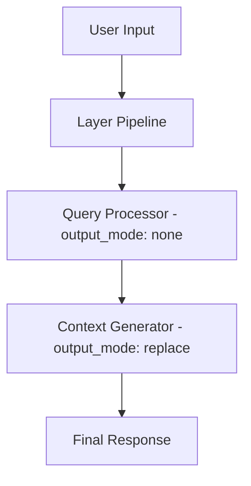

# Advanced Features Guide

## Overview

Octomind's advanced features enable sophisticated development workflows through MCP tool integration, layered AI architecture, and extensible configuration. This guide covers capabilities beyond basic session usage.

## MCP (Model-Centric Programming) Protocol

### What is MCP?

MCP enables AI models to use external tools and services through a standardized protocol. Octomind provides development capabilities through natural conversation by integrating tools seamlessly into AI interactions.

### MCP Protocol Compliance

**CRITICAL**: All Octomind MCP tools are fully protocol-compliant and handle errors gracefully:

- ✅ **Error Handling**: Tools return `McpToolResult::error()` instead of crashing communication
- ✅ **Parameter Validation**: Clear error messages for missing, empty, or wrong-type parameters
- ✅ **API Key Management**: Graceful handling of missing environment variables
- ✅ **Cancellation Support**: Proper handling of user cancellation requests
- ✅ **Standard Format**: All responses follow MCP standard: `{content: [{type: "text", text: "..."}], isError: true/false}`

### Built-in MCP Tools & Usage Patterns

- The `plan` tool provides structured, sequential task execution and progress tracking for session-driven workflows.
- Developer: shell, ast_grep, semantic_search, view_signatures, plan
- Filesystem: text_editor, list_files, extract_lines
- Web: web_search, read_html
- Agent: agent_<name> task routing

**Tool Invocation:**

---

### plan — Structured Task Management Tool

The `plan` tool enables interactive, step-by-step task management inside Octomind sessions. It supports workflow breakdown, progress tracking, and structured execution for complex development tasks.

**Purpose:**
- Break down large objectives into clear, actionable steps
- Track progress and provide visual feedback for each step
- Integrate seamlessly with session and MCP protocols

**Commands & Parameters:**
- `command` (string, required): One of the following commands:
  - **start**: Begin a new plan
    - `title` (string, required): Plan title
    - `tasks` (array of strings, required): List of subtasks/steps
  - **step**: Add progress or notes to current step
    - `content` (string, required): Progress detail
  - **next**: Mark current step as complete and advance
    - `content` (string, required): Completion summary
  - **list**: Show all steps with completion status
  - **done**: Mark plan as complete and trigger session cleanup
    - `content` (string, optional): Final summary
  - **reset**: Abort and clear current plan

**Usage Example:**
```json
{"command": "start", "title": "Implement Feature X", "tasks": ["Design API", "Write tests", "Implement logic"]}
{"command": "step", "content": "Started API design..."}
{"command": "next", "content": "API designed, moving to tests"}
{"command": "list"}
{"command": "done", "content": "Feature implemented and tests passing"}
```

**MCP Compliance:**
- All errors use `Ok(McpToolResult::error(...))` (never `Err()`)
- Parameter validation is strict; missing/invalid params return actionable MCP error objects
- Output always includes `tool_id` and follows `{content: [{type: "text", text: "..."}], isError: ...}`
- Handles cancellation, session cleanup, and preserves MCP protocol integrity

**Session Integration:**
- `/done` triggers plan completion, summary, and memory cleanup
- Full progress is tracked for review and reporting

**Benefits:**
- Structured, sequential execution of complex tasks
- Visual progress feedback within session
- Clean error handling and robust MCP protocol support

See `src/mcp/dev/plan/` for code, and test integration in `src/session/chat/session/runner.rs`.
- Single tool: clean header, no index
- Multiple tools: indexed headers

**Adding a Tool/Server:**
- Add your tool/server in config and code (see [08-mcp-server-development.md](./08-mcp-server-development.md))
- Always use config for registration, server_refs, allowed_tools
```json
// Foreground execution (default)
{"command": "ls -la"}

// Background execution
{"command": "python -m http.server 8000", "background": true}
// Returns: {"success": true, "background": true, "pid": 12345, "message": "...", "note": "Use 'kill 12345' to terminate..."}

// Kill background process
{"command": "kill 12345"}
```

**Parameters:**
- `command` (string, required): The shell command to execute
- `background` (boolean, default: false): Run command in background and return PID instead of waiting for completion

**ast_grep** - Search and refactor code using AST patterns with ast-grep (sg)
- **Structural search**: Use AST patterns instead of regex for precise code matching
- **Code refactoring**: Apply transformations using rewrite patterns
- **Multi-language support**: JavaScript, TypeScript, PHP, Rust, Python, Go, Java, C/C++
- **Context-aware output**: Configurable context lines around matches

```json
// Search for console.log calls
{"pattern": "console.log($$$)", "language": "javascript"}

// Rename function calls
{"pattern": "oldFunc($ARGS)", "rewrite": "newFunc($ARGS)", "language": "javascript"}

// Search specific files with context
{"pattern": "class $NAME", "language": "php", "paths": ["src/**/*.php"], "context": 2}
```

**Parameters:**
- `pattern` (string, required): The AST pattern to search for using ast-grep syntax
- `paths` (array, optional): File paths or glob patterns to search within (default: current directory)
- `language` (string, optional): Language of the code (e.g., 'rust', 'javascript', 'python', 'typescript', 'go', 'java', 'c', 'cpp', 'php')
- `rewrite` (string, optional): Rewrite pattern to apply for refactoring transformations
- `json_output` (boolean, default: false): Get output in JSON format
- `context` (integer, default: 0): Number of lines of context to show around matches
- `update_all` (boolean, default: false): Apply rewrites to all matches without confirmation

**Pattern Syntax Examples:**

*JavaScript/TypeScript:*
- Function calls: `console.log($$$)`, `$OBJ.$METHOD($$$)`
- Functions: `function $NAME($ARGS) { $$$ }`
- Arrow functions: `($ARGS) => $BODY`
- Variables: `const $VAR = $VALUE`

*PHP:*
- Function calls: `$NAME($$$)`
- Method calls: `$OBJ->$METHOD($$$)`
- Classes: `class $NAME { $$$ }`

*Rust:*
- Macros: `println!($$$)`
- Functions: `fn $NAME($ARGS) { $$$ }`
- Structs: `struct $NAME { $$$ }`

**agent** - Route tasks to configured AI layers for specialized processing
- **Task delegation**: Route complex tasks to specialized AI agents
- **Layer integration**: Uses the same configuration system as commands and layers
- **Tool access**: Agents can use MCP tools based on their configuration

#### Filesystem Tools (type: "builtin")
- **text_editor**: Read, write, edit files with multiple operations (view, create, str_replace, insert, line_replace, undo_edit, view_many, batch_edit)
- **extract_lines**: Extract lines from source file and append to target file without modifying source (perfect for refactoring)
- **list_files**: Browse directory structures with pattern matching and content search

#### Web Tools (type: "builtin")
- **web_search**: Search the web using Brave Search API with configurable parameters
- **image_search**: Search for images using Brave Search API with metadata and thumbnails
- **video_search**: Search for videos using Brave Search API with duration, views, and creator info
- **news_search**: Search for news articles using Brave Search API with publication dates and breaking news flags
- **read_html**: Convert HTML content to Markdown format from URLs or local files

#### Web Search Tools Configuration

All web search tools require the `BRAVE_API_KEY` environment variable to be set with your Brave Search API key.

**Setup:**
```bash
export BRAVE_API_KEY="your_brave_api_key_here"
```

**Web Search (`web_search`)**
Search the web with comprehensive filtering options:

```json
{
  "query": "rust web framework",
  "count": 10,
  "country": "US",
  "search_lang": "en",
  "ui_lang": "en-US",
  "safesearch": "moderate",
  "freshness": "pw"
}
```

Parameters:
- `query` (required): Search query (max 400 chars, 50 words)
- `count`: Results to return (1-20, default: 20)
- `offset`: Results to skip for pagination (0-9, default: 0)
- `country`: Country code (e.g., "US", "GB", "DE")
- `search_lang`: Language code (e.g., "en", "es", "fr")
- `ui_lang`: UI language (e.g., "en-US", "es-ES")
- `safesearch`: "strict", "moderate", or "off"
- `freshness`: "pd" (day), "pw" (week), "pm" (month), "py" (year)

**Image Search (`image_search`)**
Find images with metadata and thumbnails:

```json
{
  "query": "golden retriever puppy",
  "count": 20,
  "country": "US",
  "search_lang": "en",
  "safesearch": "strict"
}
```

Parameters:
- `query` (required): Image search query
- `count`: Results to return (1-100, default: 50)
- `country`: Country code for localized results
- `search_lang`: Language for search results
- `safesearch`: "strict" or "off" (default: "strict")
- `spellcheck`: Enable spellcheck (default: true)

**Video Search (`video_search`)**
Search for videos with duration, views, and creator information:

```json
{
  "query": "rust programming tutorial",
  "count": 15,
  "offset": 0,
  "country": "US",
  "search_lang": "en",
  "ui_lang": "en-US",
  "safesearch": "moderate",
  "freshness": "pm"
}
```

Parameters:
- `query` (required): Video search query
- `count`: Results to return (1-50, default: 20)
- `offset`: Results to skip for pagination (0-9, default: 0)
- `country`: Country code for localized results
- `search_lang`: Language for search results
- `ui_lang`: UI language preference
- `safesearch`: "strict", "moderate", or "off"
- `freshness`: Time filter for recent videos
- `spellcheck`: Enable spellcheck (default: true)

**News Search (`news_search`)**
Find news articles with publication dates and breaking news flags:

```json
{
  "query": "artificial intelligence breakthrough",
  "count": 10,
  "country": "US",
  "search_lang": "en",
  "freshness": "pd",
  "extra_snippets": true
}
```

Parameters:
- `query` (required): News search query
- `count`: Results to return (1-50, default: 20)
- `offset`: Results to skip for pagination (0-9, default: 0)
- `country`: Country code for localized results
- `search_lang`: Language for search results
- `ui_lang`: UI language preference
- `safesearch`: "strict", "moderate", or "off"
- `freshness`: Time filter for recent news
- `spellcheck`: Enable spellcheck (default: true)
- `extra_snippets`: Get additional excerpts (default: false)

**Best Practices:**
- Use specific, targeted queries for better results
- Use quotes for exact phrase matching: `"machine learning"`
- Use site: operator for specific domains: `site:github.com`
- Use - operator to exclude terms: `python -django`
- For images: Use descriptive visual terms
- For videos: Include keywords like "tutorial", "review", "how to"
- For news: Include current event keywords and locations

### Agent Tools Reference

The agent system enables task delegation to specialized AI agents configured in your system. Each configured agent becomes a separate MCP tool that uses the same layer configuration system as commands and regular layers.

#### How It Works

1. **Configure Agents**: Define agents using the same `LayerConfig` structure as commands and layers
2. **Use Agent Tools**: Each agent becomes a tool like `agent_context_gatherer`, `agent_code_reviewer`, etc.
3. **Output Control**: The `output_mode` setting controls what the agent tool returns

#### Agent Configuration

Agents now use the **same configuration structure** as commands and layers. Define them in the `[[agents]]` section:

```toml
# Agent definitions - each becomes a separate MCP tool
[[agents]]
name = "context_gatherer"
description = "Gather detailed context from files and codebase. Reads files, searches code patterns, and provides comprehensive information about specific areas of the codebase for development tasks."
model = "openrouter:google/gemini-2.5-flash-preview"
max_tokens = 16384
system_prompt = """You are a comprehensive context gatherer and code analyst for development tasks. Your role is to thoroughly examine codebases, understand patterns, and provide detailed information about specific areas.

Your capabilities:
- Read and analyze multiple files simultaneously
- Search for code patterns semantically across the codebase
- Understand file structures and relationships
- Extract function signatures and code structure
- Provide comprehensive context for development decisions

Always provide comprehensive, detailed analysis that helps developers understand the codebase and make informed decisions."""
temperature = 0.2
input_mode = "last"
output_mode = "none"  # Return only the gathered context (cleanest for tool use)

[agents.mcp]
server_refs = ["filesystem", "octocode"]
allowed_tools = ["text_editor", "list_files", "semantic_search", "view_signatures"]

[[agents]]
name = "code_reviewer"
description = "Review code for performance, security, and best practices issues. Analyzes code quality and suggests improvements."
model = "openrouter:anthropic/claude-3.5-sonnet"
max_tokens = 8192
system_prompt = "You are a senior code reviewer. Analyze code for quality, performance, security, and best practices. Provide detailed feedback with specific suggestions for improvement."
temperature = 0.1
input_mode = "last"
output_mode = "none"  # Return only the review results (cleanest for tool use)

[agents.mcp]
server_refs = ["developer", "filesystem"]
allowed_tools = ["text_editor", "list_files"]
```

#### Output Mode Control

The `output_mode` setting controls what the agent tool returns:

- **`"none"`**: Returns only the final layer output (cleanest for tool use) - **Recommended**
- **`"append"`**: Returns layer output + session messages (for debugging)
- **`"replace"`**: Returns layer output (same as none for agents)
- **`"last"`**: Returns only the last layer output
- **`"restart"`**: Returns only the last layer output (same as last for agents)

**Best Practice**: Use `output_mode = "none"` for clean tool responses that integrate well with other MCP tools.

#### Usage Examples

Once configured, each agent becomes a separate tool:

**Context Gatherer Agent:**
```bash
# In session
agent_context_gatherer(task="Analyze the authentication system architecture and gather all relevant files and patterns")
```

**Code Review Agent:**
```bash
# In session
agent_code_reviewer(task="Review this function for performance issues and suggest improvements")
```

#### Tool Parameters

Each agent tool has the same parameter structure:

**Parameters:**
- `task` (string, required): Task description in human language for the agent to process

#### Key Features

- **Unified Configuration**: Agents use the same `LayerConfig` structure as commands and layers
- **Individual Tools**: Each agent becomes a separate MCP tool (e.g., `agent_context_gatherer`)
- **Output Control**: `output_mode` setting controls what the agent tool returns
- **Isolated Processing**: Each agent runs in its own session context
- **Tool Access**: Agents can use MCP tools based on their MCP configuration
- **Required Description**: Description field is required and used as MCP function description
- **Flexible**: Easy to add new specialized agents with complete layer configuration

### Text Editor Tool Reference

The `text_editor` tool provides comprehensive file manipulation capabilities through multiple commands:

#### Individual Operations

**view** - Examine file contents or directory listings
```json
{"command": "view", "path": "src/main.rs"}
{"command": "view", "path": "src/main.rs", "view_range": [10, 20]}
{"command": "view", "path": "src/"}
```

**create** - Create new files with content
```json
{"command": "create", "path": "src/new_module.rs", "file_text": "pub fn hello() {\n    println!(\"Hello!\");\n}"}
```

**str_replace** - Replace specific strings in files
```json
{"command": "str_replace", "path": "src/main.rs", "old_str": "fn old_name()", "new_str": "fn new_name()"}
```

**insert** - Insert text at specific line positions
```json
{"command": "insert", "path": "src/main.rs", "insert_line": 5, "new_str": "// New comment\nlet x = 10;"}
```

**line_replace** - Replace content within specific line ranges
```json
{"command": "line_replace", "path": "src/main.rs", "view_range": [5, 8], "new_str": "fn updated_function() {\n    // New implementation\n}"}
```
- **Remove lines**: Use empty `new_str` ("") to remove lines completely
- **Refactoring workflow**: Extract code with `extract_lines`, then remove original with `line_replace` + empty `new_str`

**extract_lines** - Extract lines from source file and append to target file
```json
{"from_path": "src/utils.rs", "from_range": [10, 25], "append_path": "src/extracted.rs", "append_line": -1}
```
- **Parameters**:
  - `from_path`: Source file to extract from
  - `from_range`: [start, end] line numbers (1-indexed, inclusive)
  - `append_path`: Target file (auto-created if needed)
  - `append_line`: Insert position (0=beginning, -1=end, N=after line N)
- **Perfect for refactoring**: Move code blocks between files without modifying source

**undo_edit** - Revert the most recent edit
```json
{"command": "undo_edit", "path": "src/main.rs"}
```

**view_many** - View multiple files simultaneously
```json
{"command": "view_many", "paths": ["src/main.rs", "src/lib.rs", "tests/test.rs"]}
```

#### Batch Operations

**batch_edit** - Perform multiple editing operations in a single call
```json
{
  "command": "batch_edit",
  "operations": [
    {
      "operation": "str_replace",
      "path": "src/main.rs",
      "old_str": "old_function_name",
      "new_str": "new_function_name"
    },
    {
      "operation": "insert",
      "path": "src/lib.rs",
      "insert_line": 5,
      "new_str": "// New comment\nuse new_module;"
    },
    {
      "operation": "line_replace",
      "path": "src/config.rs",
      "view_range": [10, 15],
      "new_str": "// Updated configuration\nconst NEW_CONFIG: &str = \"value\";"
    }
  ]
}
```

**Batch Edit Features:**
- **Maximum 50 operations** per batch for performance
- **Supported operations**: str_replace, insert, line_replace
- **Cross-file editing**: Make changes across multiple files simultaneously
- **Detailed reporting**: Success/failure status for each operation
- **Error isolation**: Failed operations don't affect successful ones
- **File history preservation**: Each operation saves file history for undo

**Note**: `extract_lines` is not supported in batch operations as it's a standalone tool for file-to-file extraction.

**When to Use Batch Edit:**
- ✅ **Multiple file refactoring** - Rename functions across files
- ✅ **Consistent changes** - Apply same pattern to multiple files
- ✅ **Independent modifications** - Changes that don't depend on each other
- ✅ **Bulk updates** - Update imports, comments, or configuration
- ❌ **Sequential dependencies** - When changes depend on previous results
- ❌ **Complex logic** - When you need conditional modifications

### MCP Server Configuration

The MCP system uses a centralized server configuration in the main `[mcp]` section:

```toml
# MCP Server Configuration - Define servers once, reference everywhere
[mcp]
allowed_tools = []

# Built-in server definitions
[[mcp.servers]]
name = "developer"
type = "builtin"
timeout_seconds = 30
args = []
tools = []  # Empty means all tools enabled

[[mcp.servers]]
name = "filesystem"
type = "builtin"
timeout_seconds = 30
args = []
tools = []  # Empty means all tools enabled

[[mcp.servers]]
name = "web"
type = "builtin"
timeout_seconds = 30
args = []
tools = []  # Empty means all tools enabled

# External HTTP server example
[[mcp.servers]]
name = "web_search"
type = "http"
url = "https://mcp.so/server/webSearch-Tools"
auth_token = "optional_token"
timeout_seconds = 30
tools = []

# External command-based server example
[[mcp.servers]]
name = "local_tools"
type = "stdin"
command = "python"
args = ["-m", "my_mcp_server", "--port", "8008"]
timeout_seconds = 30
tools = ["custom_tool1", "custom_tool2"]  # Only these tools enabled
```

### Role-Based Server Access

Roles reference servers from the main MCP configuration and can limit tool access:

```toml
# Developer role with full access
[developer.mcp]
server_refs = ["developer", "filesystem", "web"]
allowed_tools = []  # Empty means all tools from referenced servers

# Assistant role with limited access
[assistant.mcp]
server_refs = ["filesystem"]
allowed_tools = ["text_editor", "list_files"]  # Only specific tools

# Custom role with external tools
[code-reviewer.mcp]
server_refs = ["developer", "web_search"]
allowed_tools = ["text_editor", "shell"]
```

### Server Types

- **developer**: Built-in development tools
  - `shell`: Terminal command execution with foreground/background support
  - `ast_grep`: AST-based code search and refactoring using ast-grep (sg)
  - `agent`: Task routing to specialized AI layers
- **filesystem**: Built-in file operations
  - `text_editor`: Comprehensive file editing with batch operations
  - `list_files`: Directory browsing with pattern matching and content search
- **web**: Built-in web tools
  - `web_search`: Web search using Brave Search API
  - `image_search`, `video_search`, `news_search`: Specialized search tools
  - `read_html`: HTML to Markdown conversion
- **external**: External MCP servers (HTTP or command-based)

### External MCP Servers

#### HTTP-based Servers
```toml
[[mcp.servers]]
name = "web_tools"
type = "http"
url = "https://api.example.com/mcp"
auth_token = "your_token"
timeout_seconds = 30
tools = []
```

#### Command-based Servers
```toml
[[mcp.servers]]
name = "custom_tools"
type = "stdin"
command = "python"
args = ["/path/to/mcp_server.py"]
timeout_seconds = 30
```

## Layered Architecture

### Overview

For complex development tasks, Octomind uses a flexible multi-stage AI processing system where each layer is fully configurable through the configuration file. All layers use the same `GenericLayer` implementation with different configurations.



### Layer Configuration System

All layers are configured through the `[[layers]]` section in your configuration file. Each layer supports:

- **Input Mode**: How the layer receives input (`last`, `all`)
- **Output Mode**: How the layer affects the session (`none`, `append`, `replace`)
- **Model Selection**: Specific model for this layer
- **MCP Tools**: Which tools the layer can access
- **Custom Prompts**: Layer-specific system prompts

#### Output Modes Explained

- **`none`**: Intermediate layer that doesn't modify the session (like task_refiner)
- **`append`**: Adds layer output as a new message to the session
- **`replace`**: Replaces the entire session content with the layer output

**Context Management Commands:**
- **`/done`**: Task completion using current model - comprehensive summarization with memorization and auto-commit

### Built-in Layer Types

#### Query Processor
- **Purpose**: Analyze and improve user requests
- **Configuration**: `output_mode = "none"` (intermediate processing)
- **Default Model**: Fast, cost-effective model for text analysis

#### Context Generator
- **Purpose**: Gather project context and prepare comprehensive responses
- **Configuration**: `output_mode = "replace"` (replaces input with enriched context)
- **Default Model**: Balanced model with tool access for code analysis

#### Reducer
- **Purpose**: Optimize and compress session history
- **Configuration**: `output_mode = "replace"` (replaces session with compressed content)
### Layered Architecture Configuration

All layers are configured through the `[[layers]]` section with consistent parameters:

```toml
[developer]
enable_layers = true

# All layers use the same GenericLayer implementation with different configurations

[[layers]]
name = "task_refiner"
model = "openrouter:openai/gpt-4.1-mini"
temperature = 0.2
input_mode = "Last"
output_mode = "none"  # Intermediate layer - doesn't modify session
builtin = true

[layers.mcp]
server_refs = []
allowed_tools = []

[[layers]]
name = "task_researcher"
model = "openrouter:google/gemini-2.5-flash-preview"
temperature = 0.2
input_mode = "Last"
output_mode = "replace"  # Replaces input with processed context
builtin = true

[layers.mcp]
server_refs = ["developer", "filesystem", "octocode"]
allowed_tools = ["search_code", "view_signatures", "list_files"]

[[layers]]
name = "reducer"
model = "openrouter:openai/o4-mini"
temperature = 0.2
input_mode = "All"
output_mode = "replace"  # Replaces entire session with reduced content
builtin = true

[layers.mcp]
server_refs = []
allowed_tools = []
```

### Custom Layer Configuration

You can create custom layers with any combination of settings:

```toml
[[layers]]
name = "code_reviewer"
model = "openrouter:anthropic/claude-3.5-sonnet"
system_prompt = "You are a senior code reviewer..."
temperature = 0.1
input_mode = "Last"
output_mode = "append"  # Add review results to session
builtin = false

[layers.mcp]
server_refs = ["developer", "filesystem"]
allowed_tools = ["text_editor", "list_files"]
```
allowed_tools = ["core", "text_editor"]
input_mode = "last"

[[layers]]
name = "developer"
enabled = true
model = "openrouter:anthropic/claude-sonnet-4"
temperature = 0.3
enable_tools = true
input_mode = "all"
```

### Session Commands for Layers

- `/layers` - Toggle layered processing on/off
- `/done` - Manually trigger context optimization
- `/info` - View token usage by layer

## Token Management

### Smart Session Continuation System

Octomind features an advanced session continuation system that automatically preserves context when token limits are reached, using AI-driven file context selection.

#### Architecture

The continuation system uses a **modular architecture** with focused components:

- **`src/session/chat/continuation/`**: **NEW MODULAR STRUCTURE**
  - `mod.rs`: Main module coordinator with public API re-exports
  - `detection.rs`: Continuation trigger logic and state checks
  - `injection.rs`: Summary request injection when limits reached
  - `processing.rs`: Response processing with **DISPLAY FIXES** for user visibility
  - `file_context.rs`: File parsing, context generation, and tests
  - `constants.rs`: All prompts and message templates
- **`src/session/chat/session_continuation.rs`**: **LEGACY COMPATIBILITY** - re-exports new API
- **`src/session/chat/response.rs`**: Integration point for continuation checks
- **`src/session/chat/context_truncation.rs`**: Continuation-aware context management
- **`src/session/chat/session/core.rs`**: Session state management with continuation tracking

#### How It Works

1. **Token Monitoring**: Every response processing checks against `max_session_tokens_threshold`
2. **Structured Summary**: AI receives a detailed prompt requesting:
   - Task objective and progress summary
   - Current state and next actions
   - Required file contexts in exact format: `filename:startline:endline`
3. **File Context Processing**: System parses AI response using regex `([^\s:]+):(\d+):(\d+)`
4. **Context Preservation**: Reads specified files with 1-indexed line numbers
5. **Session Reset**: Continues with preserved summary and file context

#### Configuration

```toml
# Smart continuation threshold (0 = disabled, >0 = enabled)
max_session_tokens_threshold = 20000

# The system automatically handles:
# - Summary request injection
# - File context parsing and reading
# - Session reset with preserved context
# - Visual feedback and error handling
```

#### File Context Format

The AI must specify required files using this exact format:
```
src/config/mod.rs:95:105
src/session/chat/response.rs:264:280
src/session/chat/session_continuation.rs:1:50
```

The system automatically:
- Parses these specifications using regex pattern matching
- Reads the specified line ranges (1-indexed)
- Includes formatted file content with line numbers
- Handles missing files gracefully with error messages

#### Advanced Features

**Error Resilience:**
- Graceful handling of missing or unreadable files
- Regex parsing with comprehensive error checking
- Fallback to original truncation if continuation fails

**Performance Optimization:**
- Maximum 10 file contexts per continuation
- Line limits to prevent excessive content (10k lines per file)
- Efficient file reading with range specification

**Integration Points:**
- Works during any token-consuming operation (user input, tool calls, etc.)
- Integrates with existing cache and cost tracking systems
- Maintains session state consistency across continuations

### Automatic Token Management

```toml
[developer]
# Warn when tool outputs exceed threshold
mcp_response_warning_threshold = 20000

# Smart session continuation when limit reached (0 = disabled)
max_session_tokens_threshold = 50000

# Cache management
cache_tokens_pct_threshold = 40
```

### Session Token Commands

- `/cache` - Mark cache checkpoint for cost savings
- `/info` - Display token usage and cost breakdown

## Advanced Configuration Patterns

### Multi-Provider Setup
```toml
# Use different providers for different purposes
[developer]
model = "openrouter:anthropic/claude-sonnet-4"  # Main development
# Layer models are configured in individual [[layers]] sections
# See the layers configuration examples above for model assignments

[assistant]
model = "openrouter:anthropic/claude-3.5-haiku"  # Lightweight chat
```

### Role-Specific Tool Access
```toml
# Security-focused role
[security-reviewer]
model = "openrouter:anthropic/claude-3.5-sonnet"
enable_layers = true

[security-reviewer.mcp]
enabled = true
server_refs = ["developer", "filesystem"]
allowed_tools = ["text_editor", "shell"]  # Limited tools for security focus

# Documentation role
[docs-writer]
model = "openrouter:openai/gpt-4o"
enable_layers = false

[docs-writer.mcp]
enabled = true
server_refs = ["filesystem"]
allowed_tools = ["text_editor", "read_html"]  # Only doc-related tools
```

### External Tool Integration
```toml
# Web development setup
[web-dev]
model = "openrouter:anthropic/claude-sonnet-4"

[web-dev.mcp]
enabled = true
server_refs = ["developer", "filesystem", "web_tools"]

# Add web-specific MCP server
[[mcp.servers]]
name = "web_tools"
type = "http"
url = "https://mcp.so/server/web-dev-tools"
timeout_seconds = 30
tools = []
```

## Session Management

### Session Persistence
- **Save sessions**: All conversations are automatically saved
- **Resume sessions**: Continue where you left off
- **Session switching**: Work on multiple projects simultaneously

### Session Commands
```bash
# In any session
/help              # Show all available commands
/list              # List all sessions
/session [name]    # Switch to another session
/save              # Manually save current session
/model [model]     # Change AI model
/clear             # Clear screen
/exit              # Exit session
```

### Session Organization
```bash
# Start named sessions for different purposes
octomind session --name "feature-auth"
octomind session --name "bugfix-login"
octomind session --name "refactor-api"

# Resume specific sessions
octomind session --resume "feature-auth"
```

## Development Workflow Integration

### Project Context Collection
Sessions automatically analyze:
- **Project structure** and organization
- **Configuration files** and build systems
- **Documentation** and README files
- **Git repository** information

### Natural Development Tasks
Instead of complex commands, simply ask:
- **"How does authentication work?"** - AI analyzes auth code
- **"Add logging to the login function"** - AI implements logging
- **"Why is the build failing?"** - AI checks build errors
- **"Refactor this function"** - AI improves code structure

### Code Analysis Capabilities
Through natural conversation:
- **File exploration**: "Show me the main configuration files"
- **Code understanding**: "Explain how this module works"
- **Pattern finding**: "Find all error handling patterns"
- **Dependency analysis**: "What files import this module?"

## Performance Optimization

### Model Selection Strategy
1. **Fast models** for simple analysis (Query Processor)
2. **Balanced models** for information gathering (Context Generator)
3. **Powerful models** for complex development tasks (Developer)

### Tool Usage Optimization
- **Batch operations**: Use `view_many` for reading multiple files, `batch_edit` for modifying multiple files
- **Specific patterns**: Use `list_files` with patterns to filter results
- **Smart caching**: Use `/cache` before large context operations

### Context Management
- **Auto-truncation**: Enable for long sessions
- **Task completion**: Use `/done` to finalize tasks with memorization and commit
- **Token monitoring**: Use `/info` to track usage

## Troubleshooting

### Common Issues

#### MCP Configuration Problems
```bash
# Validate configuration
octomind config --validate

# Check MCP server connectivity
# (Server status is checked automatically when tools are used)
```

#### Tool Access Issues
- **Check role configuration**: Ensure server_refs include needed servers
- **Verify tool permissions**: Check allowed_tools list
- **External server issues**: Verify URL and authentication

#### Layer Performance Issues
```bash
# Monitor layer performance
/info

# Disable layers temporarily
/layers

# Optimize context
/done
```

#### Token Limit Issues
```bash
# Mark cache checkpoint
/cache

# Check current usage
/info

# Optimize context manually
/done
```

### Debug Mode
```bash
# Enable debug logging in session
/loglevel debug

# Or in configuration
log_level = "debug"
```

## Best Practices

### MCP Usage
1. **Start with built-in servers** before adding external ones
2. **Limit tool access** in specialized roles for security
3. **Test external servers** thoroughly before deployment
4. **Monitor tool performance** through session feedback

### Layered Architecture
1. **Enable for complex tasks** that benefit from specialized processing
2. **Use appropriate models** for each layer's complexity
3. **Monitor token usage** across layers with `/info`
4. **Optimize context** regularly with `/done`

### Session Management
1. **Use descriptive names** for sessions
2. **Save important sessions** manually when needed
3. **Switch sessions** for different projects or tasks
4. **Monitor token usage** to control costs

### Development Workflow
1. **Ask natural questions** instead of trying to construct complex commands
2. **Be specific** about what you want to accomplish
3. **Use session commands** to manage context and performance
4. **Leverage auto-analysis** by letting sessions examine your project structure

## Migration from Legacy Configuration

### MCP Migration
**Old format:**
```toml
[mcp]
enabled = true
providers = ["core"]
```

**Current format:**
```toml
[[mcp.servers]]
name = "developer"
type = "builtin"
timeout_seconds = 30
args = []
tools = []

[developer.mcp]
server_refs = ["developer"]
allowed_tools = []
```

### Provider Migration
**Old format:**
```toml
model = "anthropic/claude-3.5-sonnet"
```

**New format:**
```toml
model = "openrouter:anthropic/claude-3.5-sonnet"
```

Octomind automatically migrates legacy configurations, but manual updates provide better control and understanding of the new simplified structure.
